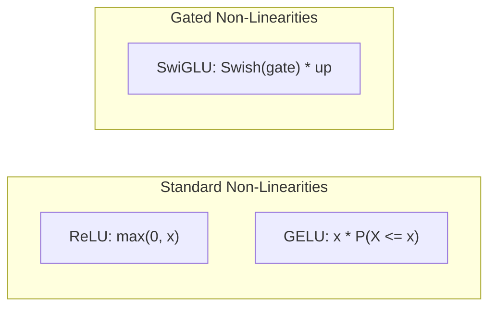

# Activations Overview

Documentation for custom activation functions implemented from scratch in `NNFS`.

---

## 💡 Overview

Activation functions introduce non-linearity into neural network architectures, enabling them to learn complex continuous mappings and representations. In `NNFS`, activation functions are implemented ground-up from mathematical primitives using PyTorch tensors without invoking high-level `torch.nn.functional` activation wrappers.

---

## ⚡ Implemented Activations

| Activation | File Link | Formula | Primary Model Usage | Key Properties |
|---|---|---|---|---|
| **ReLU** | [`relu.md`](./relu.md) | $\max(0, x)$ | Baseline Networks | Piecewise linear, fast computation, sparse activation |
| **GELU** | [`gelu.md`](./gelu.md) | $x \Phi(x) \approx 0.5 x \left(1 + \tanh\left(\sqrt{\frac{2}{\pi}}(x + 0.044715 x^3)\right)\right)$ | GPT-1, GPT-2, BERT | Smooth continuous probabilistic gating |
| **SwiGLU** | [`swiglu.md`](./swiglu.md) | $\text{Swish}_{\beta}(x_{\text{gate}}) \odot x_{\text{up}}$ | PaLM, LLaMA | Gated linear unit, superior empirical scaling |

---

## 📊 Comparison & Mathematical Curves

### Key Differences

1. **Standard vs Gated**:
   - **ReLU & GELU** map single input tensors $x \in \mathbb{R}^{B \times \dots \times D} \to \mathbb{R}^{B \times \dots \times D}$.
   - **SwiGLU** operates on dual input tensors (`gate`, `up`), acting as a multiplicative element-wise gate.

2. **Differentiability & Gradient Flow**:
   - **ReLU**: Discontinuous derivative at $x = 0$; prone to "dying ReLU" when inputs are negative.
   - **GELU**: Smooth, non-monotonic curve with negative curvature zone near $x \in (-0.1, 0)$, allowing small negative gradients.
   - **SwiGLU**: Smooth self-gating mechanism combining Swish ($\text{Swish}(x) = x \cdot \sigma(x)$) with bilinear element-wise multiplication.

---

## 📚 Detailed Documentation Pages

- 📘 [**ReLU Activation Documentation**](./relu.md)
- 📘 [**GELU Activation Documentation**](./gelu.md)
- 📘 [**SwiGLU Activation Documentation**](./swiglu.md)
