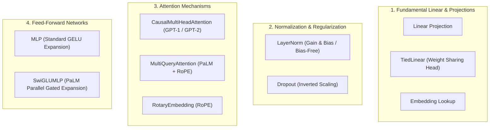

# Layers & Primitives Overview

Comprehensive documentation of fundamental neural network layer primitives implemented from scratch in `NNFS`.

---

## 💡 Overview

In `NNFS`, all neural network layers are constructed from fundamental PyTorch tensor operations (`torch.matmul`, `torch.randn`, indexed slicing, etc.) without relying on pre-packaged high-level `torch.nn` layers like `nn.Linear`, `nn.Embedding`, `nn.LayerNorm`, or `nn.MultiheadAttention`.

---

## 🧩 Categorized Primitive Layers

---

## 📊 Quick Reference Table

| Category | Primitive Layer | File Link | Key Parameters Formula | Default Bias | Model Usage |
|---|---|---|---|---|---|
| **Linear & Lookup** | `Linear` | [`linear.md`](./linear.md) | $d_{\text{in}} \cdot d_{\text{out}} + d_{\text{out}}$ | `True` | General Projections |
| | `TiedLinear` | [`tied_linear.md`](./tied_linear.md) | $0$ new weights (shares $V \times d_{\text{model}}$) | `True` | GPT-1, GPT-2, PaLM LM Head |
| | `Embedding` | [`embedding.md`](./embedding.md) | $V \cdot d_{\text{model}}$ | N/A | Token & Positional Embeddings |
| **Norm & Dropout** | `LayerNorm` | [`layer_norm.md`](./layer_norm.md) | $2 \cdot d_{\text{model}}$ (or $d_{\text{model}}$ if bias=False) | `True` | Pre-LN & Post-LN Transformer Blocks |
| | `Dropout` | [`dropout.md`](./dropout.md) | $0$ | N/A | Regularization |
| **Attention** | `CausalMultiHeadAttention` | [`causal_multi_head_attention.md`](./causal_multi_head_attention.md) | $4 d_{\text{model}}^2 + 4 d_{\text{model}}$ | `True` | GPT-1, GPT-2 |
| | `MultiQueryAttention` | [`multi_query_attention.md`](./multi_query_attention.md) | $2 d_{\text{model}}^2 + 2(d_{\text{model}} \cdot d_{\text{head}})$ | `False` | PaLM |
| | `RotaryEmbedding` | [`rope.md`](./rope.md) | $0$ (Cached frequency tables) | N/A | PaLM, LLaMA Position Encoding |
| **Feed-Forward** | `MLP` | [`mlp.md`](./mlp.md) | $2 d_{\text{model}} d_{\text{ff}} + d_{\text{ff}} + d_{\text{model}}$ | `True` | GPT-1, GPT-2 |
| | `SwiGLUMLP` | [`swiglu_mlp.md`](./swiglu_mlp.md) | $3 (d_{\text{model}} \cdot d_{\text{ff}})$ | `False` | PaLM |

---

## 📚 Detailed Documentation Pages

### 🔹 Fundamental Linear & Projections
- 📘 [**`Linear` Layer Documentation**](./linear.md)
- 📘 [**`TiedLinear` Layer Documentation**](./tied_linear.md)
- 📘 [**`Embedding` Layer Documentation**](./embedding.md)

### 🔹 Normalization & Regularization
- 📘 [**`LayerNorm` Layer Documentation**](./layer_norm.md)
- 📘 [**`Dropout` Layer Documentation**](./dropout.md)

### 🔹 Attention & Position Encodings
- 📘 [**`CausalMultiHeadAttention` Documentation**](./causal_multi_head_attention.md)
- 📘 [**`MultiQueryAttention` Documentation**](./multi_query_attention.md)
- 📘 [**`RotaryEmbedding` (RoPE) Documentation**](./rope.md)

### 🔹 Feed-Forward Expansion Networks
- 📘 [**`MLP` Layer Documentation**](./mlp.md)
- 📘 [**`SwiGLUMLP` Layer Documentation**](./swiglu_mlp.md)
