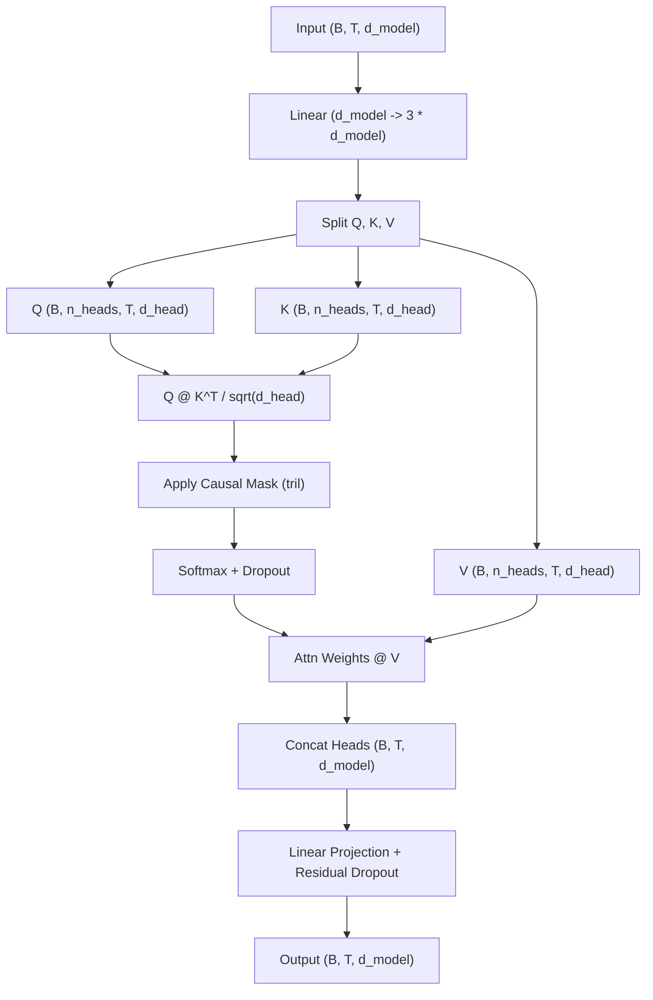

# CausalMultiHeadAttention Layer

Documentation for the `CausalMultiHeadAttention` mechanism implemented in `NNFS`.

---

## 💡 Overview

`CausalMultiHeadAttention` implements multi-head scaled dot-product self-attention with a causal autoregressive mask, preventing current sequence positions from attending to future tokens. This forms the primary attention building block for **GPT-1** and **GPT-2**.

Module Location: [`nnfs/layers/causal_multi_head_attention.py`](../../nnfs/layers/causal_multi_head_attention.py)

---

## 🏗️ Execution Architecture



---

## 📐 Mathematical Formulation

Given input hidden representation $X \in \mathbb{R}^{B \times T \times d_{\text{model}}}$:

1. **Query, Key, Value Projections**:
   $$[Q, K, V] = X W_{\text{qkv}} + b_{\text{qkv}}$$
   where $W_{\text{qkv}} \in \mathbb{R}^{d_{\text{model}} \times 3 d_{\text{model}}}$.

2. **Multi-Head Reshaping**:
   $$Q, K, V \in \mathbb{R}^{B \times n_{\text{heads}} \times T \times d_{\text{head}}}$$
   where $d_{\text{head}} = d_{\text{model}} / n_{\text{heads}}$.

3. **Scaled Causal Attention Scores**:
   $$A = \frac{Q K^T}{\sqrt{d_{\text{head}}}}$$
   $$A_{\text{masked}} = \text{masked\_fill}\left(A, \text{mask}_{\text{causal}} == 0, -\infty\right)$$
   $$W_{\text{attn}} = \text{Dropout}\left(\text{Softmax}(A_{\text{masked}}, \text{dim}=-1)\right)$$

4. **Output Assembly**:
   $$\text{Out} = \text{Dropout}\left(\left(W_{\text{attn}} V\right) W_{\text{out}} + b_{\text{out}}\right)$$

---

## 💻 Ground-Up Implementation

```python
import math
import torch
import torch.nn as nn
from .dropout import Dropout
from .linear import Linear

class CausalMultiHeadAttention(nn.Module):
    def __init__(self, d_model: int, n_heads: int, dropout: float = 0.1):
        super().__init__()
        assert d_model % n_heads == 0, "d_model must be divisible by n_heads"
        self.d_model = d_model
        self.n_heads = n_heads
        self.d_head = d_model // n_heads
        self.attn_scale = 1 / math.sqrt(self.d_head)

        self.qkv = Linear(d_model, 3 * d_model)
        self.out = Linear(d_model, d_model)
        self.attn_dropout = Dropout(dropout)
        self.resid_dropout = Dropout(dropout)

    def forward(self, input: torch.Tensor) -> torch.Tensor:
        B, T, C = input.shape
        qkv = self.qkv(input)
        q, k, v = qkv.split(self.d_model, dim=-1)

        q = q.view(B, T, self.n_heads, self.d_head).transpose(1, 2)
        k = k.view(B, T, self.n_heads, self.d_head).transpose(1, 2)
        v = v.view(B, T, self.n_heads, self.d_head).transpose(1, 2)

        att = (q @ k.transpose(-2, -1)) * self.attn_scale
        causal_mask = torch.tril(torch.ones(T, T, device=input.device, dtype=torch.bool))
        att = att.masked_fill(~causal_mask, float("-inf"))
        att = torch.softmax(att, dim=-1)
        att = self.attn_dropout(att)

        out = att @ v
        out = out.transpose(1, 2).contiguous().view(B, T, C)
        return self.resid_dropout(self.out(out))
```

---

## 📊 Tensor Shapes & Parameters

| Component | Parameter Shape | Parameter Count |
|---|---|---|
| **Combined QKV Linear (`qkv`)** | Weight: $(d_{\text{model}}, 3 d_{\text{model}})$, Bias: $(3 d_{\text{model}})$ | $3 d_{\text{model}}^2 + 3 d_{\text{model}}$ |
| **Output Projection (`out`)** | Weight: $(d_{\text{model}}, d_{\text{model}})$, Bias: $(d_{\text{model}})$ | $d_{\text{model}}^2 + d_{\text{model}}$ |
| **Total Parameters** | | **$4 d_{\text{model}}^2 + 4 d_{\text{model}}$** |

### Tensor Shapes

- Input: $(B, T, d_{\text{model}})$
- Q, K, V: $(B, n_{\text{heads}}, T, d_{\text{head}})$
- Attention Map: $(B, n_{\text{heads}}, T, T)$
- Output: $(B, T, d_{\text{model}})$
