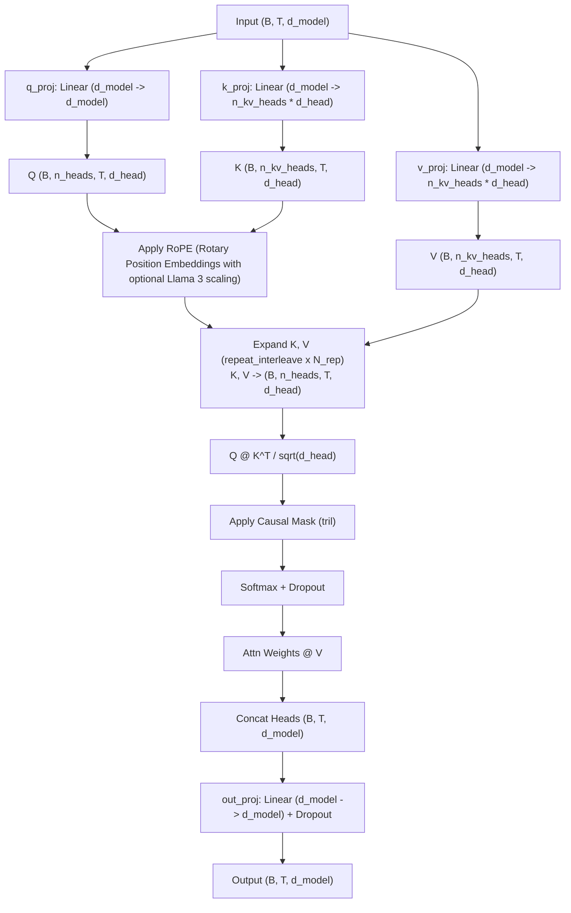

# GroupedQueryAttention Layer

Documentation for the `GroupedQueryAttention` (GQA) mechanism implemented in `NNFS`.

---

## 💡 Overview

`GroupedQueryAttention` implements Grouped-Query Attention with Rotary Position Embeddings (RoPE) and causal autoregressive masking. Introduced by Ainslie et al. (2023) and popularized in **LLaMA 2** and **LLaMA 3**, GQA partitions Query heads into groups that share a smaller set of Key and Value heads ($n_{\text{kv\_heads}} < n_{\text{heads}}$).

This strikes an optimal trade-off between the high performance of **Multi-Head Attention (MHA)** and the memory efficiency of **Multi-Query Attention (MQA)**.

Module Location: [`nnfs/layers/grouped_query_attention.py`](../../nnfs/layers/grouped_query_attention.py)

### Supported Topologies
- **Multi-Head Attention (MHA)**: When $n_{\text{kv\_heads}} = n_{\text{heads}}$ (1:1 ratio). Each Query head has its own Key/Value head.
- **Multi-Query Attention (MQA)**: When $n_{\text{kv\_heads}} = 1$. All Query heads share 1 Key/Value head (PaLM style).
- **Grouped-Query Attention (GQA)**: When $1 < n_{\text{kv\_heads}} < n_{\text{heads}}$. $N_{\text{rep}} = n_{\text{heads}} / n_{\text{kv\_heads}}$ Query heads share 1 Key/Value head (LLaMA 2 / LLaMA 3 style).

---

## 🏗️ Execution Architecture



---

## 📐 Mathematical Formulation

Given input hidden representation $X \in \mathbb{R}^{B \times T \times d_{\text{model}}}$:

1. **Query, Key, and Value Projections**:
   $$Q = X W_q \in \mathbb{R}^{B \times T \times d_{\text{model}}}$$
   $$K_{\text{raw}} = X W_k \in \mathbb{R}^{B \times T \times (n_{\text{kv\_heads}} \cdot d_{\text{head}})}$$
   $$V_{\text{raw}} = X W_v \in \mathbb{R}^{B \times T \times (n_{\text{kv\_heads}} \cdot d_{\text{head}})}$$

2. **Head Reshaping & RoPE Embedding**:
   $$Q \in \mathbb{R}^{B \times n_{\text{heads}} \times T \times d_{\text{head}}}$$
   $$K_{\text{raw}}, V_{\text{raw}} \in \mathbb{R}^{B \times n_{\text{kv\_heads}} \times T \times d_{\text{head}}}$$
   $$Q_{\text{rope}}, K_{\text{rope}} = \text{apply\_rotary\_pos\_emb}(Q, K_{\text{raw}}, \cos, \sin)$$

3. **GQA Key/Value Head Broadcast Expansion**:
   Let $N_{\text{rep}} = n_{\text{heads}} / n_{\text{kv\_heads}}$. Keys and Values are expanded along the head dimension:
   $$K = \text{repeat\_interleave}(K_{\text{rope}}, N_{\text{rep}}, \text{dim}=1) \in \mathbb{R}^{B \times n_{\text{heads}} \times T \times d_{\text{head}}}$$
   $$V = \text{repeat\_interleave}(V_{\text{raw}}, N_{\text{rep}}, \text{dim}=1) \in \mathbb{R}^{B \times n_{\text{heads}} \times T \times d_{\text{head}}}$$

4. **Scaled Causal Attention Scores & Output**:
   $$A = \frac{Q_{\text{rope}} K^T}{\sqrt{d_{\text{head}}}}$$
   $$A_{\text{masked}} = \text{masked\_fill}(A, \text{mask}_{\text{causal}} == 0, -\infty)$$
   $$W_{\text{attn}} = \text{Dropout}\left(\text{Softmax}(A_{\text{masked}}, \text{dim}=-1)\right)$$
   $$\text{Out} = \text{Dropout}\left((W_{\text{attn}} V) W_o\right)$$

---

## 💻 Ground-Up Implementation

```python
import math
import torch
import torch.nn as nn
from .dropout import Dropout
from .linear import Linear
from .rope import RotaryEmbedding, apply_rotary_pos_emb

class GroupedQueryAttention(nn.Module):
    def __init__(
        self,
        d_model: int,
        n_heads: int,
        n_kv_heads: int | None = None,
        dropout: float = 0.0,
        use_rope: bool = True,
        max_position_embeddings: int = 4096,
        rope_theta: float = 10000.0,
        rope_scaling: dict | None = None,
        bias: bool = False,
    ):
        super().__init__()
        if n_kv_heads is None:
            n_kv_heads = n_heads

        assert d_model % n_heads == 0
        assert n_heads % n_kv_heads == 0

        self.d_model = d_model
        self.n_heads = n_heads
        self.n_kv_heads = n_kv_heads
        self.n_rep = n_heads // n_kv_heads
        self.d_head = d_model // n_heads
        self.attn_scale = 1.0 / math.sqrt(self.d_head)
        self.use_rope = use_rope

        self.q_proj = Linear(d_model, d_model, bias=bias)
        self.k_proj = Linear(d_model, n_kv_heads * self.d_head, bias=bias)
        self.v_proj = Linear(d_model, n_kv_heads * self.d_head, bias=bias)
        self.out_proj = Linear(d_model, d_model, bias=bias)

        if self.use_rope:
            self.rotary_emb = RotaryEmbedding(
                self.d_head,
                max_position_embeddings=max_position_embeddings,
                base=rope_theta,
                rope_scaling=rope_scaling,
            )

        self.attn_dropout = Dropout(dropout)
        self.resid_dropout = Dropout(dropout)

    def forward(self, input: torch.Tensor) -> torch.Tensor:
        B, T, C = input.shape

        q = self.q_proj(input)
        k = self.k_proj(input)
        v = self.v_proj(input)

        q = q.view(B, T, self.n_heads, self.d_head).transpose(1, 2)
        k = k.view(B, T, self.n_kv_heads, self.d_head).transpose(1, 2)
        v = v.view(B, T, self.n_kv_heads, self.d_head).transpose(1, 2)

        if self.use_rope:
            cos, sin = self.rotary_emb(T, device=input.device)
            q, k = apply_rotary_pos_emb(q, k, cos, sin)

        if self.n_rep > 1:
            k = k.repeat_interleave(self.n_rep, dim=1)
            v = v.repeat_interleave(self.n_rep, dim=1)

        scores = (q @ k.transpose(-2, -1)) * self.attn_scale
        causal_mask = torch.tril(torch.ones(T, T, device=input.device, dtype=torch.bool))
        scores = scores.masked_fill(~causal_mask, float("-inf"))

        att = torch.softmax(scores, dim=-1)
        att = self.attn_dropout(att)

        out = att @ v
        out = out.transpose(1, 2).contiguous().view(B, T, C)

        return self.resid_dropout(self.out_proj(out))
```

---

## 📊 Tensor Shapes & Parameters

### Parameter Breakdown

| Component | Weight Matrix Shape | Parameter Count Formula | Count (NNFS Mini: $d_{\text{model}}=256, n_h=4, n_{kv}=2, d_{\text{head}}=64$) |
|---|---|---|---|
| Query Projection (`q_proj`) | $(d_{\text{model}}, d_{\text{model}})$ | $d_{\text{model}}^2$ | 65,536 |
| Key Projection (`k_proj`) | $(d_{\text{model}}, n_{\text{kv\_heads}} \cdot d_{\text{head}})$ | $d_{\text{model}} \cdot (n_{\text{kv\_heads}} \cdot d_{\text{head}})$ | 32,768 |
| Value Projection (`v_proj`) | $(d_{\text{model}}, n_{\text{kv\_heads}} \cdot d_{\text{head}})$ | $d_{\text{model}} \cdot (n_{\text{kv\_heads}} \cdot d_{\text{head}})$ | 32,768 |
| Output Projection (`out_proj`) | $(d_{\text{model}}, d_{\text{model}})$ | $d_{\text{model}}^2$ | 65,536 |
| **Total Parameters** | | **$2 d_{\text{model}}^2 + 2 d_{\text{model}} (n_{\text{kv\_heads}} d_{\text{head}})$** | **196,608** |

### Tensor Shapes

- Input: $(B, T, d_{\text{model}})$
- Q Projection: $(B, n_{\text{heads}}, T, d_{\text{head}})$
- K, V Projections (raw): $(B, n_{\text{kv\_heads}}, T, d_{\text{head}})$
- K, V Projections (expanded): $(B, n_{\text{heads}}, T, d_{\text{head}})$
- Attention Matrix: $(B, n_{\text{heads}}, T, T)$
- Output Projection: $(B, T, d_{\text{model}})$
