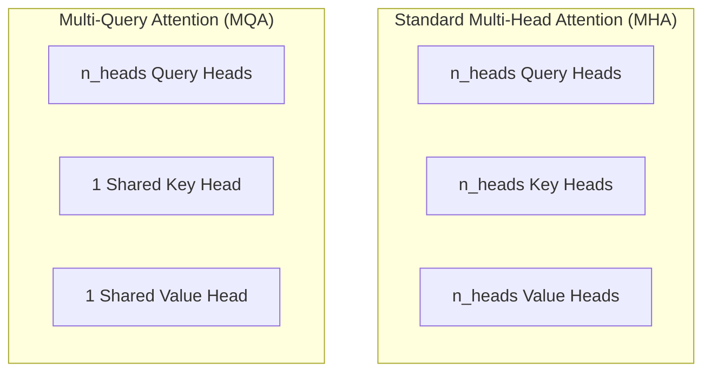

# MultiQueryAttention Layer

Documentation for the `MultiQueryAttention` (MQA) mechanism with RoPE implemented in `NNFS`.

---

## 💡 Overview

**Multi-Query Attention (MQA)** ([Shazeer, 2019](https://arxiv.org/abs/1911.02150)) is an attention variant used in **PaLM** where Queries retain multiple heads ($n_{\text{heads}}$), but Key and Value projections share a single head ($1$ head) across all Query heads.

This drastically reduces the Key-Value (KV) cache memory footprint during autoregressive inference while integrating **Rotary Position Embeddings (RoPE)** directly on Query and Key vectors.

Module Location: [`nnfs/layers/multi_query_attention.py`](../../nnfs/layers/multi_query_attention.py)

---

## 🏗️ Structural Comparison: MHA vs MQA



---

## 📐 Mathematical Formulation

Given input representation $X \in \mathbb{R}^{B \times T \times d_{\text{model}}}$ and `bias=False`:

1. **Projections**:
   $$Q = X W_q \in \mathbb{R}^{B \times T \times d_{\text{model}}}$$
   $$K = X W_k \in \mathbb{R}^{B \times T \times d_{\text{head}}}$$
   $$V = X W_v \in \mathbb{R}^{B \times T \times d_{\text{head}}}$$

2. **Reshaping & Rotary Position Embedding (RoPE)**:
   $$Q \in \mathbb{R}^{B \times n_{\text{heads}} \times T \times d_{\text{head}}}, \quad K \in \mathbb{R}^{B \times 1 \times T \times d_{\text{head}}}$$
   $$[Q_{\text{rope}}, K_{\text{rope}}] = \text{apply\_rotary\_pos\_emb}(Q, K, \cos, \sin)$$

3. **Broadcasting Scaled Attention**:
   $$A = \frac{Q_{\text{rope}} K_{\text{rope}}^T}{\sqrt{d_{\text{head}}}} \in \mathbb{R}^{B \times n_{\text{heads}} \times T \times T}$$
   $$W_{\text{attn}} = \text{Dropout}\left(\text{Softmax}\left(\text{masked\_fill}(A, \text{causal\_mask} == 0, -\infty)\right)\right)$$

4. **Output Assembly**:
   $$\text{Out} = \text{Dropout}\left(\left(W_{\text{attn}} V\right) W_{\text{out}}\right)$$

---

## 💻 Ground-Up Implementation

```python
import math
import torch
import torch.nn as nn
from .dropout import Dropout
from .linear import Linear
from .rope import RotaryEmbedding, apply_rotary_pos_emb

class MultiQueryAttention(nn.Module):
    def __init__(
        self,
        d_model: int,
        n_heads: int,
        dropout: float = 0.1,
        use_rope: bool = True,
        bias: bool = False,
        max_position_embeddings: int = 2048,
    ):
        super().__init__()
        assert d_model % n_heads == 0
        self.d_model = d_model
        self.n_heads = n_heads
        self.d_head = d_model // n_heads
        self.attn_scale = 1.0 / math.sqrt(self.d_head)
        self.use_rope = use_rope

        self.q_proj = Linear(d_model, d_model, bias=bias)
        self.k_proj = Linear(d_model, self.d_head, bias=bias)
        self.v_proj = Linear(d_model, self.d_head, bias=bias)
        self.out_proj = Linear(d_model, d_model, bias=bias)

        if self.use_rope:
            self.rotary_emb = RotaryEmbedding(self.d_head, max_position_embeddings=max_position_embeddings)
        self.attn_dropout = Dropout(dropout)
        self.resid_dropout = Dropout(dropout)

    def forward(self, input: torch.Tensor, alibi_bias: torch.Tensor | None = None) -> torch.Tensor:
        B, T, C = input.shape

        q = self.q_proj(input)  # (B, T, d_model)
        k = self.k_proj(input)  # (B, T, d_head)
        v = self.v_proj(input)  # (B, T, d_head)

        q = q.view(B, T, self.n_heads, self.d_head).transpose(1, 2)
        k = k.view(B, T, 1, self.d_head).transpose(1, 2)
        v = v.view(B, T, 1, self.d_head).transpose(1, 2)

        if self.use_rope:
            cos, sin = self.rotary_emb(T, device=input.device)
            q, k = apply_rotary_pos_emb(q, k, cos, sin)

        att = (q @ k.transpose(-2, -1)) * self.attn_scale
        if alibi_bias is not None:
            att = att + alibi_bias

        causal_mask = torch.tril(torch.ones(T, T, device=input.device, dtype=torch.bool))
        att = att.masked_fill(~causal_mask, float("-inf"))
        att = torch.softmax(att, dim=-1)
        att = self.attn_dropout(att)

        out = att @ v
        out = out.transpose(1, 2).contiguous().view(B, T, C)
        return self.resid_dropout(self.out_proj(out))
```

---

## 📊 Parameter & Shape Specifications

| Component | Formula (`bias=False`) | Count (Mini Config: $d=256, h=4, d_h=64$) |
|---|---|---|
| Query Projection (`q_proj`) | $d_{\text{model}} \cdot d_{\text{model}}$ | 65,536 |
| Key Projection (`k_proj`) | $d_{\text{model}} \cdot d_{\text{head}}$ | 16,384 |
| Value Projection (`v_proj`) | $d_{\text{model}} \cdot d_{\text{head}}$ | 16,384 |
| Output Projection (`out_proj`) | $d_{\text{model}} \cdot d_{\text{model}}$ | 65,536 |
| **Total Parameters** | **$2 d_{\text{model}}^2 + 2(d_{\text{model}} \cdot d_{\text{head}})$** | **163,840** |
