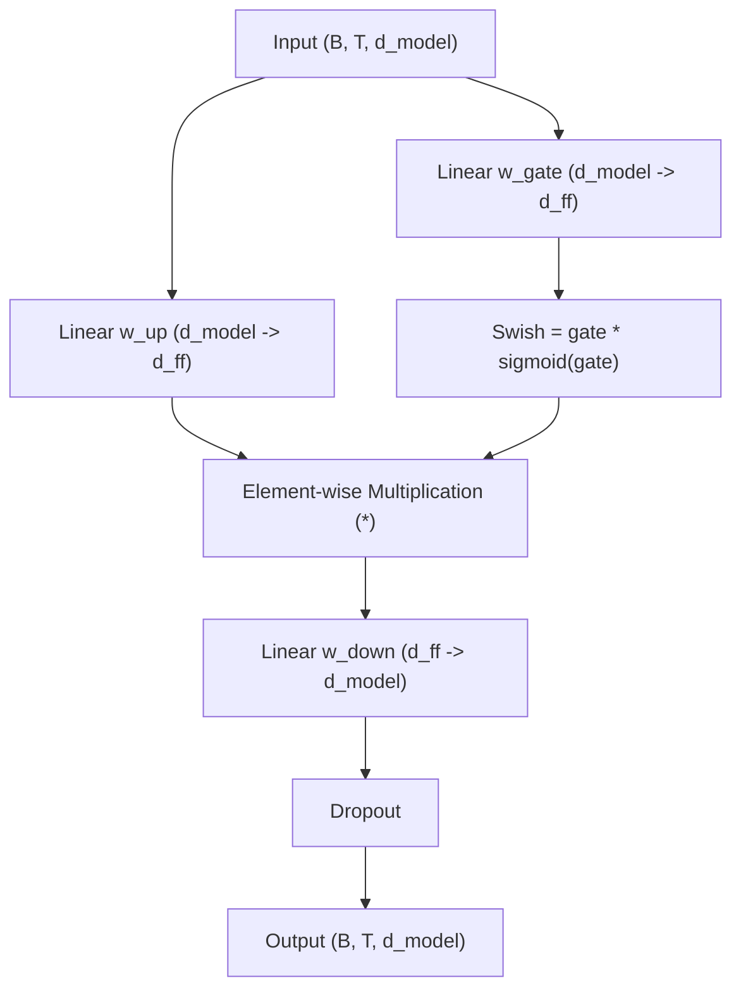

# SwiGLUMLP Layer

Documentation for the `SwiGLUMLP` feed-forward layer implemented in `NNFS`.

---

## 💡 Overview

`SwiGLUMLP` is a gated feed-forward network utilizing the **SwiGLU** activation function, as used in **PaLM** and **LLaMA**.

Rather than using a single expansion matrix $W_1$, `SwiGLUMLP` projects inputs through two parallel linear transformations (`w_gate` and `w_up`), combines them element-wise via SwiGLU ($\text{Swish}(\text{gate}) \odot \text{up}$), and projects down with `w_down`. All linear layers operate without bias (`bias=False`).

Module Location: [`nnfs/layers/swiglu_mlp.py`](../../nnfs/layers/swiglu_mlp.py)

---

## 🏗️ Structure Flow



---

## 📐 Mathematical Formulation

Given input matrix $X \in \mathbb{R}^{B \times T \times d_{\text{model}}}$ and `bias=False`:

1. **Gate and Up Projections**:
   $$G = X W_{\text{gate}} \in \mathbb{R}^{B \times T \times d_{\text{ff}}}$$
   $$U = X W_{\text{up}} \in \mathbb{R}^{B \times T \times d_{\text{ff}}}$$

2. **SwiGLU Gating**:
   $$H = \text{SwiGLU}(G, U) = \left(G \odot \sigma(G)\right) \odot U$$

3. **Down Projection & Dropout**:
   $$Y = \text{Dropout}\left(H W_{\text{down}}\right)$$

---

## 💻 Ground-Up Implementation

```python
import torch
import torch.nn as nn
from nnfs.activations import SwiGLU
from .dropout import Dropout
from .linear import Linear

class SwiGLUMLP(nn.Module):
    """Feed-Forward Network with SwiGLU activation as used in PaLM.

    Computes: Output = Dropout( ( Swish(x * W_gate) * (x * W_up) ) * W_down )
    where linear transformations have no bias by default.
    """

    def __init__(self, d_model: int, d_ff: int, dropout: float = 0.1, bias: bool = False):
        super().__init__()
        self.w_gate = Linear(d_model, d_ff, bias=bias)
        self.w_up = Linear(d_model, d_ff, bias=bias)
        self.w_down = Linear(d_ff, d_model, bias=bias)
        self.act = SwiGLU()
        self.dropout = Dropout(dropout)

    def forward(self, input: torch.Tensor) -> torch.Tensor:
        gate = self.w_gate(input)
        up = self.w_up(input)
        hidden = self.act(gate, up)
        out = self.w_down(hidden)
        return self.dropout(out)
```

---

## 📊 Parameter & Shape Specifications

| Component | Weight Matrix Shape (`bias=False`) | Parameters Count |
|---|---|---|
| **Gate Layer (`w_gate`)** | $(d_{\text{model}}, d_{\text{ff}})$ | $d_{\text{model}} \cdot d_{\text{ff}}$ |
| **Up Layer (`w_up`)** | $(d_{\text{model}}, d_{\text{ff}})$ | $d_{\text{model}} \cdot d_{\text{ff}}$ |
| **Down Layer (`w_down`)** | $(d_{\text{ff}}, d_{\text{model}})$ | $d_{\text{ff}} \cdot d_{\text{model}}$ |
| **Total Parameters** | | **$3 (d_{\text{model}} \cdot d_{\text{ff}})$** |
