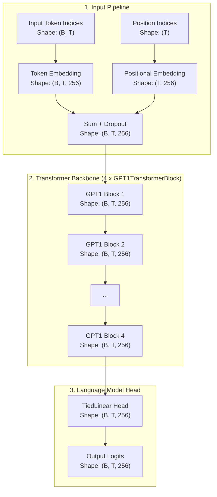
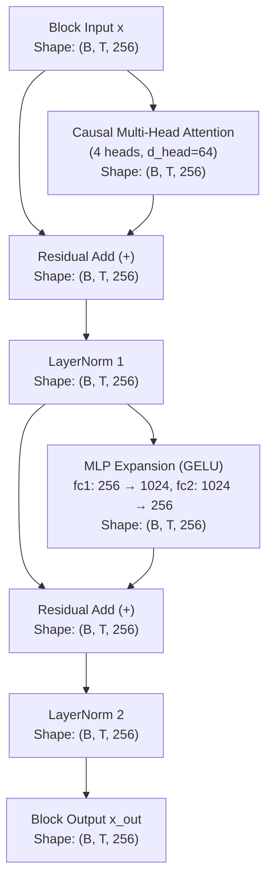

# GPT-1 Architecture

Comprehensive documentation of the **GPT-1 (Generative Pre-trained Transformer 1)** architecture implemented in `NNFS`.

---

## 💡 Overview

GPT-1 is an autoregressive, decoder-only Transformer language model introduced by OpenAI in 2018 ([Radford et al.](https://cdn.openai.com/research-covers/language-unsupervised/language_understanding_paper.pdf)). It leverages self-attention mechanisms to learn long-range language dependencies through generative pre-training followed by task-specific fine-tuning.

In `NNFS`, GPT-1 is implemented with clean, modular primitives matching the original **Post-Layer Normalization (Post-LN)** design.

### Key Architectural Characteristics
- **Post-Layer Normalization**: Layer normalization (`LayerNorm`) is applied **after** residual connections within each sub-block.
- **Tied Embedding Weights**: Output classification head (`TiedLinear`) shares weights with the token embedding matrix (`Embedding`).
- **Learned Positional Embeddings**: Positional encodings are learned embeddings up to sequence length `block_size`.
- **Causal Masking**: Upper-triangular mask ensures tokens attend only to current and preceding positions.

---

## 🏗️ High-Level Architecture

The flow below details how input token sequences are transformed into output vocabulary logits in GPT-1, with tensor dimensions using the baseline config (`vocab_size=256`, `d_model=256`, `block_size=1024`, `n_layers=4`).

---

## 🧩 Transformer Block (Post-LN)

Each `GPT1TransformerBlock` processes the hidden state using two main sub-layers: **Causal Self-Attention** and a **Feed-Forward Expansion Network (MLP)**. GPT-1 uses **Post-Layer Normalization**, where the residual addition occurs prior to layer normalization.

### Mathematical Formulations

Given input tensor $x \in \mathbb{R}^{B \times T \times d_{\text{model}}}$:

1. **Self-Attention Sub-layer**:
   $$\text{x}_{\text{attn}} = \text{CausalMultiHeadAttention}(x)$$
   $$\text{x}_{\text{res1}} = \text{LayerNorm}_1(x + \text{x}_{\text{attn}})$$

2. **Feed-Forward Sub-layer**:
   $$\text{x}_{\text{ffn}} = \text{MLP}(\text{x}_{\text{res1}})$$
   $$\text{x}_{\text{out}} = \text{LayerNorm}_2(\text{x}_{\text{res1}} + \text{x}_{\text{ffn}})$$

---

## ⚙️ Component Breakdown

### 1. `CausalMultiHeadAttention`
Computes scaled dot-product attention over single input tensor projected into Queries ($Q$), Keys ($K$), and Values ($V$):
$$Q, K, V = \text{Linear}_{d_{\text{model}} \rightarrow 3d_{\text{model}}}(x)$$
$$\text{Attention}(Q, K, V) = \text{Softmax}\left(\frac{Q K^T}{\sqrt{d_{\text{head}}}} + M\right) V$$
where $M_{i, j} = 0$ if $i \ge j$ and $-\infty$ otherwise (causal mask).

### 2. `MLP`
Two-layer feed-forward network with expansion ratio:
$$\text{MLP}(h) = \text{Dropout}\left(\text{Linear}_{d_{\text{ff}} \rightarrow d_{\text{model}}}\left(\text{GELU}\left(\text{Linear}_{d_{\text{model}} \rightarrow d_{\text{ff}}}(h)\right)\right)\right)$$

### 3. `TiedLinear`
Reuses token embedding weights $W_{\text{tok}} \in \mathbb{R}^{V \times d_{\text{model}}}$ as transposed weights $W_{\text{head}} = W_{\text{tok}}^T \in \mathbb{R}^{d_{\text{model}} \times V}$ for language modeling output:
$$\text{Logits} = x \cdot W_{\text{tok}}^T$$

---

## 📊 Parameter & Shape Specifications

### Mini-GPT1 Baseline Configurations (NNFS Default)

| Parameter | Symbol | Mini Value |
|---|---|---|
| Vocabulary Size | `vocab_size` | 256 |
| Context Length | `block_size` | 1024 |
| Hidden Dimension | `d_model` | 256 |
| Transformer Layers | `n_layers` | 4 |
| Attention Heads | `n_heads` | 4 |
| Head Dimension | `d_head` | 64 |
| Feed-Forward Dim | `d_ff` | 1024 |

### Parameter Breakdown

| Component | Parameters Formula | Count (Mini Config) |
|---|---|---|
| Token Embedding (`tok_embed`) | $V \times d_{\text{model}}$ | 65,536 |
| Positional Embedding (`pos_embed`) | $T \times d_{\text{model}}$ | 262,144 |
| **Per Transformer Block ($\times 4$)** | | |
| - Attention (`qkv` + `out`) | $d_{\text{model}} \times 3d_{\text{model}} + 3d_{\text{model}} + d_{\text{model}}^2 + d_{\text{model}}$ | 263,168 |
| - LayerNorms (`ln1` + `ln2`) | $2 \times (2 \times d_{\text{model}})$ | 1,024 |
| - MLP (`fc1` + `fc2`) | $d_{\text{model}} \times d_{\text{ff}} + d_{\text{ff}} + d_{\text{ff}} \times d_{\text{model}} + d_{\text{model}}$ | 525,568 |
| **Total Block Params ($\times 4$)** | $4 \times 789,760$ | 3,159,040 |
| Final Head (`lm_head`) | Tied to `tok_embed` (0 new) | 0 |
| **Total Model Parameters** | | **3,486,720** |
