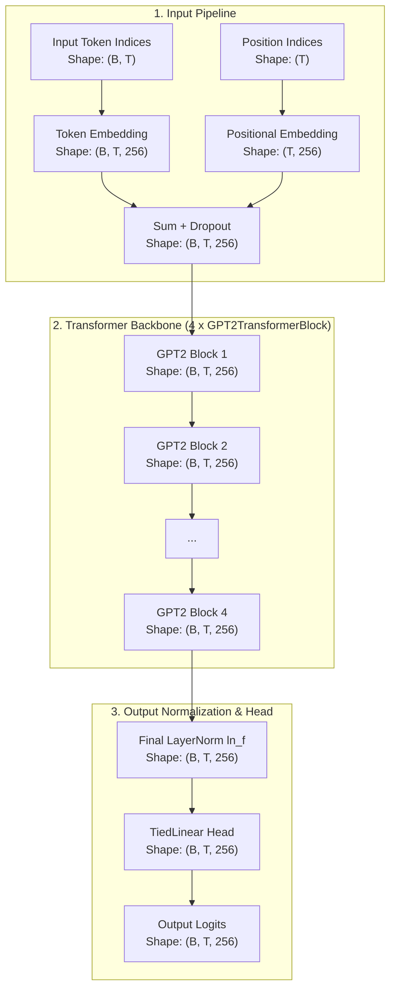
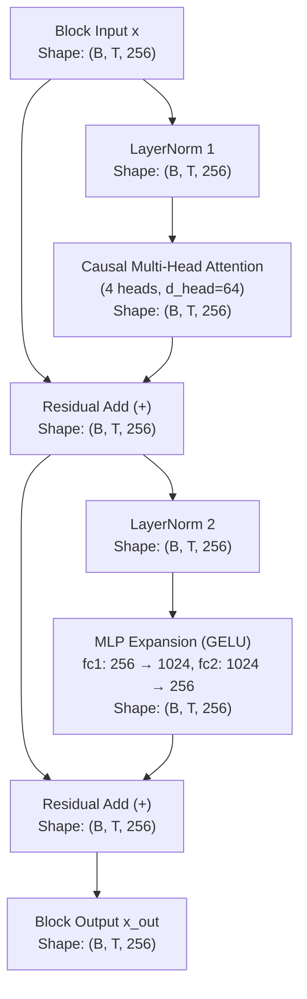

# GPT-2 Architecture

Comprehensive documentation of the **GPT-2 (Generative Pre-trained Transformer 2)** architecture implemented in `NNFS`.

---

## 💡 Overview

GPT-2 is an enhanced decoder-only Transformer language model introduced by OpenAI in 2019 ([Radford et al.](https://cdn.openai.com/better-language-models/language_models_are_unsupervised_multitask_learners.pdf)). Building upon GPT-1, GPT-2 introduced key architectural improvements to increase numerical stability at scale and support zero-shot multi-task learning.

In `NNFS`, GPT-2 implements **Pre-Layer Normalization (Pre-LN)** with an additional final layer normalization step (`ln_f`) before output projections.

### Key Architectural Improvements over GPT-1
- **Pre-Layer Normalization (Pre-LN)**: `LayerNorm` is placed **before** self-attention and MLP sub-layers, providing an unimpeded identity shortcut along the residual stream.
- **Final Layer Normalization (`ln_f`)**: Added after the final transformer block to normalize hidden states before passing to the language modeling head.
- **Weight Tying**: Output classification head (`TiedLinear`) shares weights with the token embedding matrix.
- **Stable Gradient Flow**: Pre-LN architecture eliminates the need for warm-up stages during training compared to Post-LN.

---

## 🏗️ High-Level Architecture

The flow below details how token inputs pass through Pre-LN blocks and final layer normalization in GPT-2, with tensor dimensions using the baseline config (`vocab_size=256`, `d_model=256`, `block_size=1024`, `n_layers=4`).

---

## 🧩 Transformer Block (Pre-LN)

Each `GPT2TransformerBlock` applies layer normalization **prior** to attention and MLP operations. This design preserves an uncalibrated identity path across the residual stream, enabling smoother gradient flow.

### Mathematical Formulations

Given block input $x \in \mathbb{R}^{B \times T \times d_{\text{model}}}$:

1. **Self-Attention Sub-layer**:
   $$\text{x}_{\text{norm1}} = \text{LayerNorm}_1(x)$$
   $$\text{x}_{\text{res1}} = x + \text{CausalMultiHeadAttention}(\text{x}_{\text{norm1}})$$

2. **Feed-Forward Sub-layer**:
   $$\text{x}_{\text{norm2}} = \text{LayerNorm}_2(\text{x}_{\text{res1}})$$
   $$\text{x}_{\text{out}} = \text{x}_{\text{res1}} + \text{MLP}(\text{x}_{\text{norm2}})$$

3. **Final Layer Normalization & Output Head**:
   $$\text{Logits} = \text{TiedLinear}\left(\text{LayerNorm}_f(\text{x}_{\text{final}})\right)$$

---

## 🔄 Structural Comparison: GPT-1 vs GPT-2

| Architectural Aspect | GPT-1 | GPT-2 |
|---|---|---|
| **Layer Normalization Placement** | **Post-LN**: Normalized after residual addition | **Pre-LN**: Normalized before sub-layers |
| **Final LayerNorm (`ln_f`)** | Absent | Present after final block |
| **Residual Stream Integrity** | Distorted by layer norms in execution path | Direct identity shortcut across blocks |
| **Training Stability** | Requires careful learning rate warmups | Highly stable, allows deeper architectures |

---

## 📊 Parameter & Shape Specifications

### Mini-GPT2 Baseline Configurations (NNFS Default)

| Parameter | Symbol | Mini Value |
|---|---|---|
| Vocabulary Size | `vocab_size` | 256 |
| Context Length | `block_size` | 1024 |
| Hidden Dimension | `d_model` | 256 |
| Transformer Layers | `n_layers` | 4 |
| Attention Heads | `n_heads` | 4 |
| Head Dimension | `d_head` | 64 |
| Feed-Forward Dim | `d_ff` | 1024 |

### Parameter Breakdown

| Component | Parameters Formula | Count (Mini Config) |
|---|---|---|
| Token Embedding (`tok_embed`) | $V \times d_{\text{model}}$ | 65,536 |
| Positional Embedding (`pos_embed`) | $T \times d_{\text{model}}$ | 262,144 |
| **Per Transformer Block ($\times 4$)** | | |
| - LayerNorms (`ln1` + `ln2`) | $2 \times (2 \times d_{\text{model}})$ | 1,024 |
| - Attention (`qkv` + `out`) | $d_{\text{model}} \times 3d_{\text{model}} + 3d_{\text{model}} + d_{\text{model}}^2 + d_{\text{model}}$ | 263,168 |
| - MLP (`fc1` + `fc2`) | $d_{\text{model}} \times d_{\text{ff}} + d_{\text{ff}} + d_{\text{ff}} \times d_{\text{model}} + d_{\text{model}}$ | 525,568 |
| **Total Block Params ($\times 4$)** | $4 \times 789,760$ | 3,159,040 |
| **Final LayerNorm (`ln_f`)** | $2 \times d_{\text{model}}$ (gain + bias) | **512** |
| Final Head (`lm_head`) | Tied to `tok_embed` (0 new) | 0 |
| **Total Model Parameters** | | **3,487,232** |
