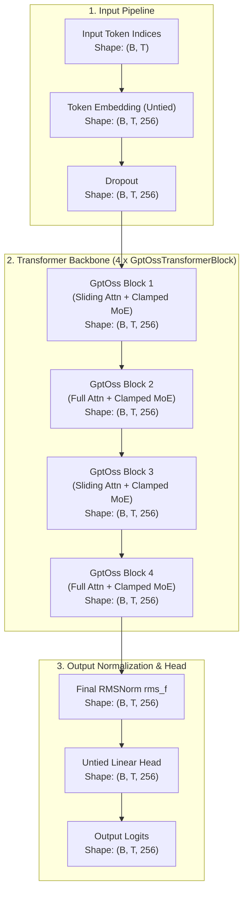
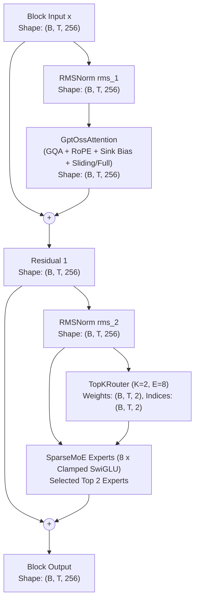

# GPT-OSS Architecture

Comprehensive documentation of the **GPT-OSS** architecture implemented in `NNFS`.

---

## 💡 Overview

[GPT-OSS](https://arxiv.org/abs/2508.10925) (OpenAI, 2025) is an autoregressive Sparse Mixture-of-Experts (MoE) decoder-only language model series released with open weights under the Apache 2.0 license. The family comprises two variants: **`gpt-oss-20b`** (20.9B total params, ~3.6B active) and **`gpt-oss-120b`** (116.8B total params, ~5.1B active).

Architecturally, both models share the exact same mathematical primitives, dense backbone hidden size ($d_{\text{model}} = 2880$), intermediate expert size ($d_{\text{ff}} = 2880$), and attention dimensions ($N_q=64, N_{kv}=8, d_{\text{head}}=64$). Scaling from 20B to 120B is achieved purely through **depth (24 to 36 layers)** and **MoE expert capacity (32 to 128 experts per layer)**.

### Key Architectural Characteristics
- **Learned Attention Sink (Denominator Bias)**: Each attention head learns a scalar parameter $b_h$ in the denominator of the softmax function, enabling heads to divert attention mass to "null" and output zero when context tokens are irrelevant.
- **Alternating Sliding-Window Attention**: Even layers utilize a local sliding-window attention pattern ($128$ tokens), while odd layers apply full causal attention across the entire context.
- **Clamped SwiGLU Expert MLPs**: Gate projections in each expert are clamped to `[-7.0, 7.0]` prior to computing Swish, preventing extreme activation spikes and stabilizing training/quantization dynamics.
- **Sparse MoE with Top-4 Routing**: A linear router projects residual activations to expert logits, selecting the top 4 experts weighted by softmax over only the top 4 candidates.
- **Grouped-Query Attention (GQA) with Projection Biases**: Query heads are grouped ($8:1$ ratio) sharing key-value heads, with bias terms enabled across all attention linear transformations.
- **Rotary Position Embeddings with YaRN**: High-frequency rotary embeddings with base frequency $\theta = 150,000$ and YaRN context scaling extending context length to 131,072 tokens.
- **Untied Classification Head**: Independent linear classification head (`Linear(d_model, vocab_size, bias=False)`), untied from input token embeddings.

---

## 🏗️ High-Level Architecture

The flow below details how input token sequences are transformed into output vocabulary logits in GPT-OSS, with tensor dimensions using the baseline config (`vocab_size=256`, `d_model=256`, `block_size=1024`, `n_layers=4`, `num_experts=8`, `top_k_experts=2`).

---

## 🧩 Transformer Block (GptOssTransformerBlock)

Each `GptOssTransformerBlock` processes hidden states using Pre-RMSNorm residual connections around Grouped-Query Attention with Attention Sinks/RoPE and Sparse Mixture-of-Experts with clamped SwiGLU activations.

### Mathematical Formulations

Given input tensor $x \in \mathbb{R}^{B \times T \times d_{\text{model}}}$:

1. **Sub-layer 1 (GQA with Learned Attention Sink and RoPE)**:
   $$\mathbf{x}_{\text{norm1}} = \text{RMSNorm}(x, \gamma_1) = \frac{x}{\sqrt{\frac{1}{d_{\text{model}}} \sum_{i=1}^{d_{\text{model}}} x_i^2 + \epsilon}} \odot \gamma_1$$
   $$\mathbf{q} = \mathbf{x}_{\text{norm1}} W_q + \mathbf{b}_q, \quad \mathbf{k} = \mathbf{x}_{\text{norm1}} W_k + \mathbf{b}_k, \quad \mathbf{v} = \mathbf{x}_{\text{norm1}} W_v + \mathbf{b}_v$$
   $$\mathbf{q}_{\text{rope}}, \mathbf{k}_{\text{rope}} = \text{ApplyRoPE}(\mathbf{q}, \mathbf{k}, \theta=150000)$$
   $$S_{ij} = \frac{\mathbf{q}_{\text{rope}, i} \mathbf{k}_{\text{rope}, j}^T}{\sqrt{d_{\text{head}}}} + M_{ij}$$
   $$\text{AttentionScore}_{ij} = \frac{\exp(S_{ij})}{\sum_{l \in \text{context}} \exp(S_{il}) + \exp(b_h)}$$
   $$\mathbf{x}_{\text{sub1}} = x + \left(\sum_j \text{AttentionScore}_{ij} \mathbf{v}_j\right) W_o + \mathbf{b}_o$$

2. **Sub-layer 2 (Sparse Mixture-of-Experts with Clamped SwiGLU)**:
   $$\mathbf{x}_{\text{norm2}} = \text{RMSNorm}(\mathbf{x}_{\text{sub1}}, \gamma_2)$$
   $$\mathbf{g} = \mathbf{x}_{\text{norm2}} W_g \quad \text{where } W_g \in \mathbb{R}^{d_{\text{model}} \times E}$$
   $$\text{TopKIndices}, \text{TopKLogits} = \text{TopK}(\mathbf{g})$$
   $$\text{RoutingWeights} = \text{Softmax}(\text{TopKLogits})$$
   $$\text{SwiGLU}_e(z) = \left( \text{Swish}(\text{clamp}(z W_{\text{gate}}^{(e)}, -7.0, 7.0)) \odot (z W_{\text{up}}^{(e)}) \right) W_{\text{down}}^{(e)}$$
   $$\text{MoE}(\mathbf{x}_{\text{norm2}}) = \sum_{k \in \text{TopKIndices}} \text{RoutingWeights}_k \cdot \text{SwiGLU}_k(\mathbf{x}_{\text{norm2}})$$
   $$\mathbf{x}_{\text{output}} = \mathbf{x}_{\text{sub1}} + \text{MoE}(\mathbf{x}_{\text{norm2}})$$

---

## ⚙️ Component Breakdown

### 1. `GptOssAttention`
Implements Grouped-Query Attention with linear projection biases and a learned per-head attention sink scalar $b_h$. Supports alternating local sliding window attention (default 128 tokens) on even layers and full causal attention on odd layers.

### 2. `TopKRouter` & `SparseMoE`
Projects normalized activations to gating logits for $E$ experts, computes softmax routing weights over the top $K$ chosen experts ($K=4$ in full models, $K=2$ in mini), and accumulates weighted expert outputs.

### 3. `Clamped SwiGLU` Expert MLP
Each expert applies SwiGLU feed-forward transformations with gate clamping within $[-7.0, 7.0]$ to eliminate activation outliers.

### 4. `Untied Linear Head`
Unlike tied embeddings, GPT-OSS employs an independent `Linear(d_model, vocab_size, bias=False)` projection layer.

---

## 📊 Parameter & Shape Specifications

### Mini-GPT-OSS Baseline Configurations (NNFS Default)

| Parameter | Symbol | Mini Value |
|---|---|---|
| Vocabulary Size | `vocab_size` | 256 |
| Context Length | `block_size` | 1024 |
| Hidden Dimension | `d_model` | 256 |
| Transformer Layers | `n_layers` | 4 |
| Attention Query Heads | `n_heads` | 4 |
| Head Dimension | `d_head` | 64 |
| Key-Value Heads | `n_kv_heads` | 2 |
| Feed-Forward Dim (Per Expert) | `d_ff` | 128 |
| Number of Experts | `num_experts` | 8 |
| Active Experts per Token | `top_k_experts` | 2 |
| Attention Biases | `attention_bias` | True |
| Attention Sink Bias | `sink_bias` | True |
| SwiGLU Clamp Limit | `swiglu_limit` | 7.0 |
| Embedding Tying | `tie_word_embeddings` | False |

### Parameter Breakdown (Total vs Active)

| Component | Parameters Formula | Total Count | Active Count per Token |
|---|---|---|---|
| Token Embedding (`tok_embed`) | $V \times d_{\text{model}}$ | 65,536 | 65,536 |
| **Per Transformer Block ($\times 4$)** | | | |
| ├── Attention RMSNorm (`rms_1`) | $d_{\text{model}}$ | 256 | 256 |
| ├── Attention Sinks (`sink_bias`) | $N_q$ | 4 | 4 |
| ├── Attention Projections (`attn`) | $(d_{\text{model}} \cdot N_q d_k + N_q d_k) + 2(d_{\text{model}} \cdot N_{kv} d_k + N_{kv} d_k) + (N_q d_k \cdot d_{\text{model}} + d_{\text{model}})$ | 197,376 | 197,376 |
| ├── MoE RMSNorm (`rms_2`) | $d_{\text{model}}$ | 256 | 256 |
| ├── MoE Router (`router.gate`) | $d_{\text{model}} \times E$ | 2,048 | 2,048 |
| └── **8 Clamped SwiGLU Experts** | $E \times 3(d_{\text{model}} \times d_{\text{ff}})$ ($K=2$ active) | 786,432 | 196,608 |
| **Total Per Block ($\times 4$)** | | **986,372** | **396,548** |
| Final RMSNorm (`rms_f`) | $d_{\text{model}}$ | 256 | 256 |
| Untied Linear Head (`lm_head`) | $d_{\text{model}} \times V$ | 65,536 | 65,536 |
| **Total Model Parameters** | | **4,076,816** | **1,717,520** |

---

## 🧪 Verification Workflow

After writing or updating model documentation:
1. Validate Mermaid syntax by inspecting the rendered diagram nodes.
2. Verify that parameter count formulas match exact module parameter counts printed by `build_model("configs/gpt_oss_moe_config.yaml")`.
3. Run the test suite: `.venv/bin/python -m unittest discover tests`.
