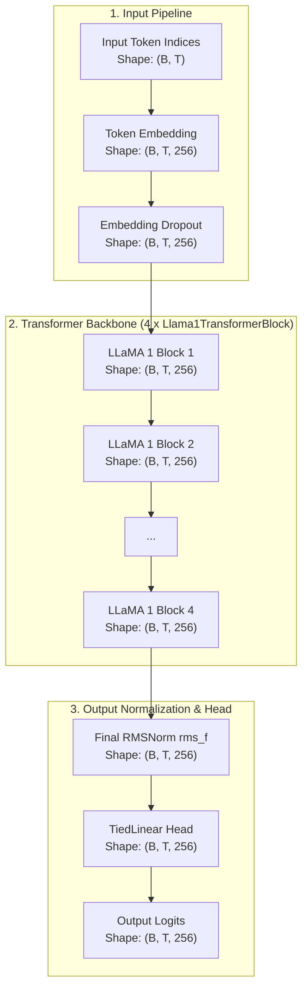
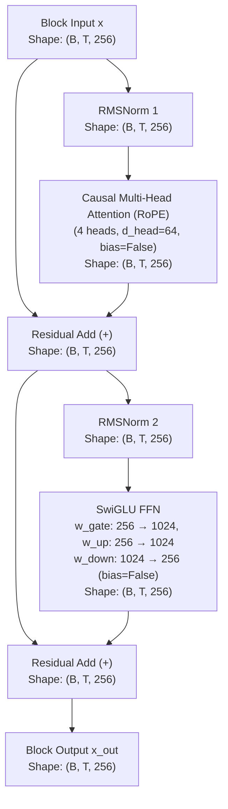

# LLaMA 1 Architecture

Comprehensive documentation of the **LLaMA 1** architecture implemented in `NNFS`.

---

## 💡 Overview

LLaMA 1 is an open and efficient decoder-only Transformer foundation language model introduced by Meta AI in 2023 ([Touvron et al.](https://arxiv.org/abs/2302.13971)). It incorporates key architectural improvements over standard Transformers to improve training efficiency, numerical stability, and positional extrapolation.

In `NNFS`, LLaMA 1 is implemented with modular primitives matching the original **RMSNorm Pre-LN** design.

### Key Architectural Characteristics
- **Pre-normalization with RMSNorm**: Layer normalization is replaced with Root Mean Square Layer Normalization (`RMSNorm`), applied **before** attention and feed-forward sub-layers.
- **Rotary Position Embeddings (RoPE)**: Absolute position embeddings are omitted; relative positional information is injected by rotating Query and Key projections.
- **SwiGLU Activation Function**: Replaces standard ReLU/GELU activations in the feed-forward network with SwiGLU gating ($\text{Swish}(x W_{\text{gate}}) \odot (x W_{\text{up}})$).
- **Bias-Free Linear Layers**: All linear projections ($W_q, W_k, W_v, W_o, W_{\text{gate}}, W_{\text{up}}, W_{\text{down}}$, and LM Head) omit bias parameters (`bias=False`).
- **Tied Embedding Weights**: Output classification head (`TiedLinear`) shares weights with the token embedding matrix (`Embedding`).

---

## 🏗️ High-Level Architecture

The flow below details how input token sequences pass through RMSNorm Pre-LN blocks and final RMSNorm in LLaMA 1, with tensor dimensions using the baseline config (`vocab_size=256`, `d_model=256`, `block_size=1024`, `n_layers=4`).

---

## 🧩 Transformer Block (Pre-LN RMSNorm)

Each `Llama1TransformerBlock` applies RMSNorm prior to attention and SwiGLU operations, incorporating Rotary Position Embeddings (RoPE) on Query and Key projections.

### Mathematical Formulations

Given block input $x \in \mathbb{R}^{B \times T \times d_{\text{model}}}$:

1. **Self-Attention Sub-layer**:
   $$\text{x}_{\text{norm1}} = \text{RMSNorm}_1(x)$$
   $$\text{x}_{\text{attn}} = \text{CausalMultiHeadAttention}_{\text{RoPE}}(\text{x}_{\text{norm1}})$$
   $$\text{x}_{\text{res1}} = x + \text{x}_{\text{attn}}$$

2. **SwiGLU Feed-Forward Sub-layer**:
   $$\text{x}_{\text{norm2}} = \text{RMSNorm}_2(\text{x}_{\text{res1}})$$
   $$\text{x}_{\text{ffn}} = \left(\text{Swish}(\text{x}_{\text{norm2}} W_{\text{gate}}) \odot (\text{x}_{\text{norm2}} W_{\text{up}})\right) W_{\text{down}}$$
   $$\text{x}_{\text{out}} = \text{x}_{\text{res1}} + \text{x}_{\text{ffn}}$$

3. **Final Normalization & Output Head**:
   $$\text{Logits} = \text{TiedLinear}\left(\text{RMSNorm}_f(\text{x}_{\text{final}})\right)$$

---

## ⚙️ Component Breakdown

### 1. `RMSNorm`
Normalizes inputs by scaling by the root mean square without mean centering:
$$\text{RMSNorm}(x) = \frac{x}{\sqrt{\frac{1}{d} \sum_{i=1}^d x_i^2 + \epsilon}} \odot \gamma$$

### 2. `CausalMultiHeadAttention` with RoPE
Computes attention with Rotary Position Embeddings applied to Query ($Q$) and Key ($K$) vectors prior to scaled dot-product attention:
$$R_{\Theta, m}^d = \text{diag}\left(R_{\theta_1, m}, R_{\theta_2, m}, \dots, R_{\theta_{d/2}, m}\right)$$
$$\text{Attention}(R_m Q, R_n K, V) = \text{Softmax}\left(\frac{(R_m Q) (R_n K)^T}{\sqrt{d_{\text{head}}}} + M\right) V$$

### 3. `SwiGLUMLP`
Feed-forward network utilizing SiLU (Swish) gated activations:
$$\text{SwiGLU}(x) = \left(\text{SiLU}(x W_{\text{gate}}) \odot (x W_{\text{up}})\right) W_{\text{down}}$$

### 4. `TiedLinear`
Reuses token embedding weights $W_{\text{tok}} \in \mathbb{R}^{V \times d_{\text{model}}}$ as transposed weights $W_{\text{head}} = W_{\text{tok}}^T \in \mathbb{R}^{d_{\text{model}} \times V}$ for language modeling output:
$$\text{Logits} = x \cdot W_{\text{tok}}^T$$

---

## 📊 Parameter & Shape Specifications

### Mini-LLaMA 1 Baseline Configurations (NNFS Default)

| Parameter | Symbol | Mini Value |
|---|---|---|
| Vocabulary Size | `vocab_size` | 256 |
| Context Length | `block_size` | 1024 |
| Hidden Dimension | `d_model` | 256 |
| Transformer Layers | `n_layers` | 4 |
| Attention Heads | `n_heads` | 4 |
| Head Dimension | `d_head` | 64 |
| Feed-Forward Dim | `d_ff` | 1024 |

### Parameter Breakdown

| Component | Parameters Formula | Count (Mini Config) |
|---|---|---|
| Token Embedding (`tok_embed`) | $V \times d_{\text{model}}$ | 65,536 |
| Positional Embedding (`pos_embed`) | None (RoPE based) | 0 |
| **Per Transformer Block ($\times 4$)** | | |
| - RMSNorms (`rms_1` + `rms_2`) | $2 \times d_{\text{model}}$ | 512 |
| - Attention (`qkv` + `out`, bias=False) | $d_{\text{model}} \times 3d_{\text{model}} + d_{\text{model}}^2$ | 262,144 |
| - SwiGLU FFN (`w_gate` + `w_up` + `w_down`) | $3 \times (d_{\text{model}} \times d_{\text{ff}})$ | 786,432 |
| **Total Block Params ($\times 4$)** | $4 \times 1,049,088$ | 4,196,352 |
| **Final RMSNorm (`rms_f`)** | $d_{\text{model}}$ | **256** |
| Final Head (`lm_head`) | Tied to `tok_embed` (0 new) | 0 |
| **Total Model Parameters** | | **4,262,144** |
