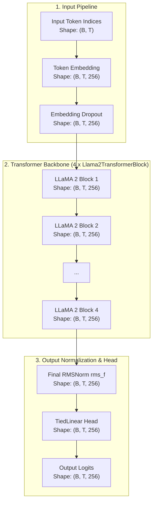
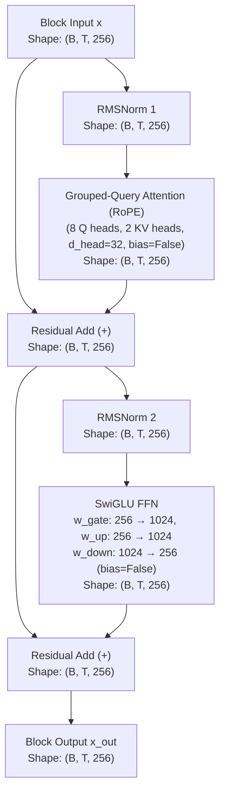

# LLaMA 2 Architecture

Comprehensive documentation of the **LLaMA 2** architecture implemented in `NNFS`.

---

## 💡 Overview

LLaMA 2 is an open collection of pretrained and fine-tuned generative text models ranging from 7 billion to 70 billion parameters, introduced by Meta AI in 2023 ([Touvron et al.](https://huggingface.co/papers/2307.09288)). It builds upon LLaMA 1 with increased context capacity, upgraded pretraining token volume (2.0 Trillion tokens), and Grouped-Query Attention (GQA) for efficient inference decoding at scale.

In `NNFS`, LLaMA 2 is implemented with modular primitives matching the original **RMSNorm Pre-LN**, **Grouped-Query Attention (GQA)**, and **SwiGLU** design.

### Key Architectural Characteristics
- **Grouped-Query Attention (GQA)**: Query heads ($n_{\text{heads}}$) are partitioned into groups sharing a smaller number of Key/Value heads ($n_{\text{kv\_heads}}$). This cuts KV-cache memory bandwidth consumption by up to $8\times$ during autoregressive decoding.
- **Extended Context Length (4096 Tokens)**: Context window is doubled compared to LLaMA 1 (2,048 tokens), enabling longer sequence reasoning and context handling.
- **Pre-normalization with RMSNorm**: Layer normalization is replaced with Root Mean Square Layer Normalization (`RMSNorm`), applied **before** attention and feed-forward sub-layers.
- **Rotary Position Embeddings (RoPE)**: Relative positional information is injected by rotating Query and Key projections prior to attention calculation.
- **SwiGLU Activation Function**: Replaces GELU/ReLU activations in the feed-forward network with SwiGLU gating ($\text{Swish}(x W_{\text{gate}}) \odot (x W_{\text{up}})$).
- **Bias-Free Linear Layers**: All linear projections ($W_q, W_k, W_v, W_o, W_{\text{gate}}, W_{\text{up}}, W_{\text{down}}$, and LM Head) omit bias parameters (`bias=False`).
- **Tied Embedding Weights**: Output classification head (`TiedLinear`) shares weights with the token embedding matrix (`Embedding`).

---

## 🏗️ High-Level Architecture

The flow below details how input token sequences pass through RMSNorm Pre-LN blocks and final RMSNorm in LLaMA 2, with tensor dimensions using the baseline config (`vocab_size=256`, `d_model=256`, `block_size=1024`, `n_layers=4`, `n_heads=8`, `n_kv_heads=2`).

---

## 🧩 Transformer Block (Grouped-Query Attention & SwiGLU)

Each `Llama2TransformerBlock` applies RMSNorm prior to attention and SwiGLU operations, incorporating Grouped-Query Attention (GQA) with RoPE positional encoding.

### Mathematical Formulations

Given block input $x \in \mathbb{R}^{B \times T \times d_{\text{model}}}$:

1. **Grouped-Query Attention Sub-layer**:
   $$\text{x}_{\text{norm1}} = \text{RMSNorm}_1(x)$$
   $$\text{x}_{\text{attn}} = \text{GroupedQueryAttention}_{\text{RoPE}}(\text{x}_{\text{norm1}})$$
   $$\text{x}_{\text{res1}} = x + \text{x}_{\text{attn}}$$

2. **SwiGLU Feed-Forward Sub-layer**:
   $$\text{x}_{\text{norm2}} = \text{RMSNorm}_2(\text{x}_{\text{res1}})$$
   $$\text{x}_{\text{ffn}} = \left(\text{Swish}(\text{x}_{\text{norm2}} W_{\text{gate}}) \odot (\text{x}_{\text{norm2}} W_{\text{up}})\right) W_{\text{down}}$$
   $$\text{x}_{\text{out}} = \text{x}_{\text{res1}} + \text{x}_{\text{ffn}}$$

3. **Final Normalization & Output Head**:
   $$\text{Logits} = \text{TiedLinear}\left(\text{RMSNorm}_f(\text{x}_{\text{final}})\right)$$

---

## ⚙️ Component Breakdown

### 1. `GroupedQueryAttention`
Projects Query vectors into $n_{\text{heads}}$ heads and Key/Value vectors into $n_{\text{kv\_heads}}$ heads. Key and Value projections are expanded across Query head groups using repeat interleave factor $N_{\text{rep}} = n_{\text{heads}} / n_{\text{kv\_heads}}$:
$$Q = \text{Linear}_q(x), \quad K = \text{Repeat}\left(\text{Linear}_k(x), N_{\text{rep}}\right), \quad V = \text{Repeat}\left(\text{Linear}_v(x), N_{\text{rep}}\right)$$
$$\text{Attention}(R_m Q, R_n K, V) = \text{Softmax}\left(\frac{(R_m Q) (R_n K)^T}{\sqrt{d_{\text{head}}}} + M\right) V$$

### 2. `RMSNorm`
Normalizes inputs by scaling by the root mean square without mean centering:
$$\text{RMSNorm}(x) = \frac{x}{\sqrt{\frac{1}{d} \sum_{i=1}^d x_i^2 + \epsilon}} \odot \gamma$$

### 3. `SwiGLUMLP`
Feed-forward network utilizing SiLU (Swish) gated activations:
$$\text{SwiGLU}(x) = \left(\text{SiLU}(x W_{\text{gate}}) \odot (x W_{\text{up}})\right) W_{\text{down}}$$

### 4. `TiedLinear`
Reuses token embedding weights $W_{\text{tok}} \in \mathbb{R}^{V \times d_{\text{model}}}$ as transposed weights $W_{\text{head}} = W_{\text{tok}}^T \in \mathbb{R}^{d_{\text{model}} \times V}$ for language modeling output:
$$\text{Logits} = x \cdot W_{\text{tok}}^T$$

---

## 📊 Parameter & Shape Specifications

### Mini-LLaMA 2 Baseline Configurations (NNFS Default)

| Parameter | Symbol | Mini Value |
|---|---|---|
| Vocabulary Size | `vocab_size` | 256 |
| Context Length | `block_size` | 1024 |
| Hidden Dimension | `d_model` | 256 |
| Transformer Layers | `n_layers` | 4 |
| Query Attention Heads | `n_heads` | 4 |
| Key-Value Heads | `n_kv_heads` | 2 |
| Head Dimension | `d_head` | 64 |
| Feed-Forward Dim | `d_ff` | 1024 |

### Parameter Breakdown

| Component | Parameters Formula | Count (Mini Config) |
|---|---|---|
| Token Embedding (`tok_embed`) | $V \times d_{\text{model}}$ | 65,536 |
| Positional Embedding (`pos_embed`) | None (RoPE based) | 0 |
| **Per Transformer Block ($\times 4$)** | | |
| - RMSNorms (`rms_1` + `rms_2`) | $2 \times d_{\text{model}}$ | 512 |
| - Attention (`q_proj` + `k_proj` + `v_proj` + `out_proj`, bias=False) | $d_{\text{model}}^2 + 2 \times (d_{\text{model}} \times n_{\text{kv\_heads}} \times d_{\text{head}}) + d_{\text{model}}^2$ | 196,608 |
| - SwiGLU FFN (`w_gate` + `w_up` + `w_down`) | $3 \times (d_{\text{model}} \times d_{\text{ff}})$ | 786,432 |
| **Total Block Params ($\times 4$)** | $4 \times 983,552$ | 3,934,208 |
| **Final RMSNorm (`rms_f`)** | $d_{\text{model}}$ | **256** |
| Final Head (`lm_head`) | Tied to `tok_embed` (0 new) | 0 |
| **Total Model Parameters** | | **4,000,000** |
