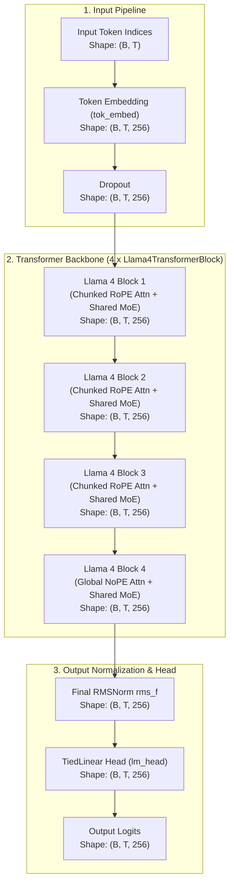
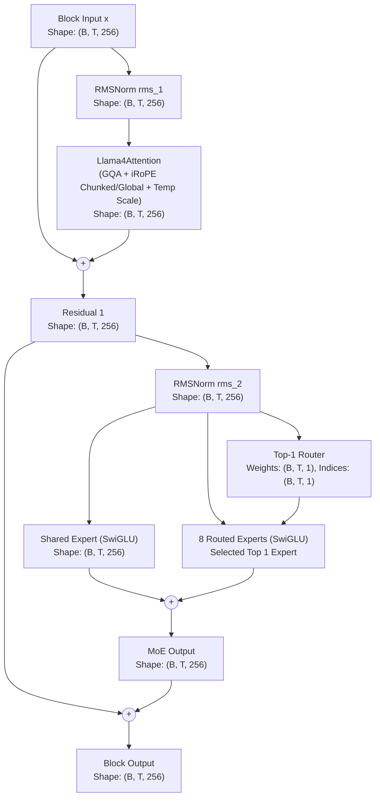

# Llama 4 Architecture

Comprehensive documentation of the **Llama 4** architecture implemented in `NNFS`.

---

## 💡 Overview

[Llama 4](https://arxiv.org/abs/2505.06839) (Meta AI, 2025) introduces a major architectural evolution in open-weight foundation models by integrating native **Mixture-of-Experts (MoE)**, **early-fusion multimodality**, and **iRoPE (Interleaved Rotary Positional Embeddings)** for massive context horizons. The primary released variants are **`Llama 4 Scout`** (109B total params, 17B active, 16 experts, 10M context window) and **`Llama 4 Maverick`** (400B total params, 17B active, 128 experts, 1M context window), both distilled from the flagship **`Llama 4 Behemoth`** (~2T total params, 288B active).

### Scout vs. Maverick Architectural Comparison

| Dimension | Llama 4 Scout | Llama 4 Maverick | Architectural Relationship |
|---|---|---|---|
| **Active Parameters** | **17 Billion** | **17 Billion** | **Identical**: Same dense active compute backbone ($d_{\text{model}}=5120$, $48$ layers, $40$ Q heads, $8$ KV heads). |
| **Total Parameters** | **~109 Billion** | **~400 Billion** | **Expert Capacity**: Maverick stores $\sim 3.7\times$ more total parameters in memory. |
| **Routed Experts** | **16 Experts** | **128 Experts** | **Granularity**: Maverick partitions representation into $8\times$ finer-grained specialized experts. |
| **Active Experts / Token** | **1 Shared + 1 Routed** | **1 Shared + 1 Routed** | **Identical**: Top-1 routed expert selection + 1 universally activated shared expert. |
| **Context Window** | **10 Million Tokens** | **1 Million Tokens** | **Specialization**: Scout focuses on extreme long-context retrieval; Maverick targets deep reasoning and coding. |
| **Attention & Positional Encoding** | iRoPE (3:1 Chunked RoPE : Global NoPE) + Temp Scaling | iRoPE (3:1 Chunked RoPE : Global NoPE) + Temp Scaling | **Identical Blueprint**: Chunked local attention with RoPE interleaved with full causal NoPE attention. |

### Key Architectural Characteristics
- **Shared + Routed Sparse MoE (`SharedSparseMoE`)**: Every token is processed by an unconditional **Shared Expert** capturing general language representation, plus a **Top-1 Router** assigning the token to one specialized **Routed Expert**.
- **iRoPE (Interleaved Rotary Positional Embeddings)**: Alternates between **Chunked RoPE Attention** (local context window, e.g. 8,192 tokens in full scale, 256 in mini config) and **Global NoPE Attention** (full causal attention without position embeddings) in a 3:1 ratio.
- **Inference-Time Attention Temperature Scaling**: Modulates attention scaling by a temperature factor to prevent attention score explosion and guarantee numerical stability over massive sequences.
- **Grouped-Query Attention (GQA)**: Employs an efficient query-to-KV head ratio ($5:1$ in full scale, $2:1$ in mini config) with bias-free linear projections.
- **Pre-RMSNorm Normalization**: RMSNorm precedes attention and MoE blocks with no additive biases.
- **SwiGLU Activations**: All shared and routed experts utilize SwiGLU non-linearities.

---

## 🏗️ High-Level Architecture

The flow below details how input token sequences are transformed into output vocabulary logits in Llama 4, with tensor dimensions using the baseline config (`vocab_size=256`, `d_model=256`, `block_size=1024`, `n_layers=4`, `num_experts=8`, `top_k_experts=1`, `irope_ratio=3`).

---

## 🧩 Transformer Block (Llama4TransformerBlock)

Each `Llama4TransformerBlock` processes hidden states using Pre-RMSNorm residual connections around `Llama4Attention` (Chunked RoPE or Global NoPE) and `SharedSparseMoE` (Shared SwiGLU Expert + Top-1 Routed SwiGLU Expert).

### Mathematical Formulations

Given input tensor $x \in \mathbb{R}^{B \times T \times d_{\text{model}}}$:

1. **Sub-layer 1 (Llama 4 Attention with iRoPE & Temperature Scaling)**:
   $$\mathbf{x}_{\text{norm1}} = \text{RMSNorm}(x) = \frac{x}{\sqrt{\frac{1}{d_{\text{model}}} \sum_{i=1}^{d_{\text{model}}} x_i^2 + \epsilon}} \odot \gamma_1$$
   $$\mathbf{q} = \mathbf{x}_{\text{norm1}} W_q, \quad \mathbf{k} = \mathbf{x}_{\text{norm1}} W_k, \quad \mathbf{v} = \mathbf{x}_{\text{norm1}} W_v$$
   
   If `is_rope_layer` is True:
   $$\mathbf{q}_{\text{rope}}, \mathbf{k}_{\text{rope}} = \text{ApplyRoPE}(\mathbf{q}, \mathbf{k}, \theta=500000)$$
   $$M_{ij} = \begin{cases} 0 & \text{if } 0 \le i - j < C_{\text{chunk}} \\ -\infty & \text{otherwise} \end{cases}$$
   
   If `is_rope_layer` is False (Global NoPE layer):
   $$\mathbf{q}_{\text{rope}} = \mathbf{q}, \quad \mathbf{k}_{\text{rope}} = \mathbf{k}$$
   $$M_{ij} = \begin{cases} 0 & \text{if } i \ge j \\ -\infty & \text{otherwise} \end{cases}$$

   Attention logits with temperature scaling factor $\tau$:
   $$S_{ij} = \frac{\mathbf{q}_{\text{rope}, i} \mathbf{k}_{\text{rope}, j}^T}{\sqrt{d_{\text{head}}} \cdot \tau} + M_{ij}$$
   $$\mathbf{x}_{\text{sub1}} = x + \text{Softmax}(S) \mathbf{v} W_o$$

2. **Sub-layer 2 (Shared-and-Routed Sparse MoE)**:
   $$\mathbf{x}_{\text{norm2}} = \text{RMSNorm}(\mathbf{x}_{\text{sub1}})$$
   $$\text{SharedOut} = \text{SwiGLU}_{\text{shared}}(\mathbf{x}_{\text{norm2}})$$
   $$\mathbf{g} = \mathbf{x}_{\text{norm2}} W_{\text{gate\_router}} \in \mathbb{R}^{B \times T \times E}$$
   $$\text{Top1Index}, \text{Top1Logit} = \text{TopK}(\mathbf{g}, K=1)$$
   $$\text{RoutingWeight} = \text{Softmax}(\text{Top1Logit})$$
   $$\text{RoutedOut} = \text{RoutingWeight} \cdot \text{SwiGLU}_{\text{routed}, \text{Top1Index}}(\mathbf{x}_{\text{norm2}})$$
   $$\mathbf{x}_{\text{output}} = \mathbf{x}_{\text{sub1}} + \text{SharedOut} + \text{RoutedOut}$$

---

## ⚙️ Component Breakdown

### 1. `SharedSparseMoE`
Implements the hybrid dual-expert path of Llama 4:
- 1 Unconditional Shared Expert ($\text{SwiGLUMLP}$) that processes all tokens.
- $N$ Specialized Routed Experts ($\text{SwiGLUMLP}$) selected via a `TopKRouter` ($K=1$).

### 2. `Llama4Attention`
Implements Grouped-Query Attention with iRoPE support (chunked RoPE attention vs. global causal NoPE attention) and attention query-key temperature scaling.

### 3. `Llama4TransformerBlock`
Combines Pre-RMSNorm, `Llama4Attention`, and `SharedSparseMoE` into a modular residual transformer layer.

### 4. `Llama4` & `Llama4Config`
Encapsulates full model instantiation, parameter accounting via `count_active_parameters()`, MoE telemetry extraction with `get_router_outputs()`, and serialization via `save_pretrained()` and `load_pretrained()`. Includes classmethod presets for `llama_4_scout` and `llama_4_maverick`.

---

## 📊 Parameter & Shape Specifications

### Mini-Llama 4 Baseline Configurations (NNFS Default)

| Parameter | Symbol | Mini Value | Full Scout Value | Full Maverick Value |
|---|---|---|---|---|
| Vocabulary Size | `vocab_size` | 256 | 128,256 | 128,256 |
| Context Length | `block_size` | 1024 | 10,485,760 (10M) | 1,048,576 (1M) |
| Hidden Dimension | `d_model` | 256 | 5,120 | 5,120 |
| Transformer Layers | `n_layers` | 4 | 48 | 48 |
| Attention Query Heads | `n_heads` | 4 | 40 | 40 |
| Key-Value Heads | `n_kv_heads` | 2 | 8 | 8 |
| Head Dimension | `d_head` | 64 | 128 | 128 |
| Feed-Forward Dim (Per Expert) | `d_ff` | 1024 | 8,192 | 8,192 |
| Shared Feed-Forward Dim | `d_ff_shared` | 1024 | 8,192 | 8,192 |
| Number of Routed Experts | `num_experts` | 8 | 16 | 128 |
| Active Routed Experts / Token | `top_k_experts` | 1 | 1 | 1 |
| iRoPE Ratio (RoPE : NoPE) | `irope_ratio` | 3 (3:1) | 3 (3:1) | 3 (3:1) |
| Attention Chunk Size | `chunk_size` | 256 | 8,192 | 8,192 |
| RoPE Base Frequency | `rope_theta` | 500,000.0 | 500,000.0 | 500,000.0 |
| Embedding Tying | `tie_word_embeddings` | True | False | False |

### Parameter Breakdown (Total vs Active)

| Component | Parameters Formula | Total Count | Active Count per Token |
|---|---|---|---|
| Token Embedding (`tok_embed`) | $V \times d_{\text{model}}$ | 65,536 | 65,536 |
| **Per Transformer Block ($\times 4$)** | | | |
| ├── Attention RMSNorm (`rms_1`) | $d_{\text{model}}$ | 256 | 256 |
| ├── Attention Projections (`attn`) | $d_{\text{model}} \cdot N_q d_k + 2(d_{\text{model}} \cdot N_{kv} d_k) + N_q d_k \cdot d_{\text{model}}$ | 196,608 | 196,608 |
| ├── MoE RMSNorm (`rms_2`) | $d_{\text{model}}$ | 256 | 256 |
| ├── MoE Router (`router.gate`) | $d_{\text{model}} \times E$ | 2,048 | 2,048 |
| ├── **1 Shared SwiGLU Expert** | $3 \times (d_{\text{model}} \times d_{\text{ff\_shared}})$ | 786,432 | 786,432 |
| └── **8 Routed SwiGLU Experts** | $E \times 3(d_{\text{model}} \times d_{\text{ff}})$ ($K=1$ active) | 6,291,456 | 786,432 |
| **Total Per Block ($\times 4$)** | | **7,277,056** | **1,772,032** |
| Final RMSNorm (`rms_f`) | $d_{\text{model}}$ | 256 | 256 |
| Tied Classification Head (`lm_head`) | Tied to `tok_embed` | 0 | 0 |
| **Total Model Parameters** | | **29,174,016** | **7,153,920** |

---

## 🧪 Verification Workflow

After writing or updating model documentation:
1. Validate Mermaid syntax by inspecting the rendered diagram nodes.
2. Verify that parameter count formulas match exact module parameter counts printed by `build_model("configs/llama4_moe_config.yaml")`.
3. Run the test suite: `.venv/bin/python -m unittest discover tests`.
