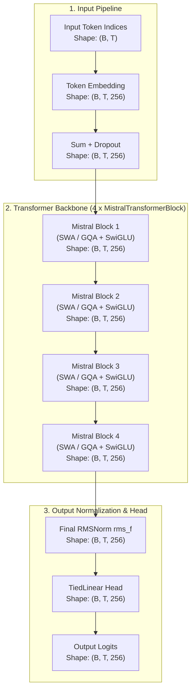
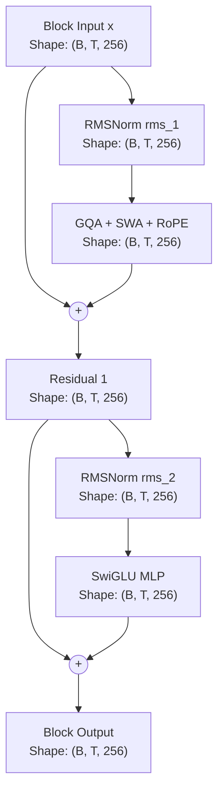

# Mistral Architecture

Comprehensive documentation of the **Mistral** architecture implemented in `NNFS`.

---

## 💡 Overview

[Mistral 7B](https://arxiv.org/abs/2310.06825) (Jiang et al., 2023) is an efficient 7.3 billion parameter decoder-only language model that outperforms LLaMA 2 13B across all benchmarks and matches LLaMA 1 34B on mathematics and reasoning. 

Mistral introduces key architectural innovations designed to improve inference speed and memory efficiency during long-context generation: **Sliding Window Attention (SWA)**, **Grouped-Query Attention (GQA)**, **SwiGLU Activation**, **Pre-RMSNorm**, and **Rotary Position Embeddings (RoPE)** with high base frequencies ($\theta = 1,000,000.0$).

### Key Architectural Characteristics
- **Sliding Window Attention (SWA)**: Constrains causal self-attention to a sliding window of size $W$ (default $W=4096$). Token $i$ attends only to tokens in $[i - W + 1, i]$, scaling attention compute to $\mathcal{O}(W \cdot T)$.
- **Interleaved SWA Support**: Supports alternating Sliding Window Attention and Full Global Attention across transformer layers (used in Ministral 8B).
- **Grouped-Query Attention (GQA)**: Query heads ($N_q$) are partitioned into groups sharing a smaller number of Key/Value heads ($N_{kv}$), compressing KV cache size.
- **SwiGLU MLP**: Gated linear unit FFN using the Swish activation function with bias-free linear projections.
- **Pre-RMSNorm & Tied Head**: RMSNorm layer normalization applied prior to sub-layers, paired with a weight-tied linear output classification head.

---

## 🏗️ High-Level Architecture

The flow below details how input token sequences are transformed into output vocabulary logits in Mistral, with tensor dimensions using the baseline config (`vocab_size=256`, `d_model=256`, `block_size=1024`, `n_layers=4`).

---

## 🧩 Transformer Block (MistralTransformerBlock)

Each `MistralTransformerBlock` processes hidden states using Pre-RMSNorm residual connections around Grouped-Query Attention with SWA and SwiGLU Feed-Forward sub-layers.

### Mathematical Formulations

Given input tensor $x \in \mathbb{R}^{B \times T \times d_{\text{model}}}$:

1. **Sub-layer 1 (Grouped-Query Attention with SWA & RoPE)**:
   $$\mathbf{x}_{\text{norm1}} = \text{RMSNorm}(x, \gamma_1) = \frac{x}{\sqrt{\frac{1}{d_{\text{model}}} \sum_{i=1}^{d_{\text{model}}} x_i^2 + \epsilon}} \odot \gamma_1$$
   $$\mathbf{q} = \mathbf{x}_{\text{norm1}} W_q, \quad \mathbf{k} = \mathbf{x}_{\text{norm1}} W_k, \quad \mathbf{v} = \mathbf{x}_{\text{norm1}} W_v$$
   $$\mathbf{q}_{\text{rope}}, \mathbf{k}_{\text{rope}} = \text{ApplyRoPE}(\mathbf{q}, \mathbf{k}, \theta=10^6)$$
   $$S_{i,j} = \begin{cases} \frac{\mathbf{q}_{i} \mathbf{k}_{j}^T}{\sqrt{d_{\text{head}}}}, & \text{if } 0 \le i - j < W \\ -\infty, & \text{otherwise} \end{cases}$$
   $$\mathbf{x}_{\text{sub1}} = x + \text{Softmax}(S) \mathbf{v} W_o$$

2. **Sub-layer 2 (SwiGLU Feed-Forward Network)**:
   $$\mathbf{x}_{\text{norm2}} = \text{RMSNorm}(\mathbf{x}_{\text{sub1}}, \gamma_2)$$
   $$\text{FFN}(\mathbf{x}_{\text{norm2}}) = \left( \text{Swish}(\mathbf{x}_{\text{norm2}} W_{\text{gate}}) \odot \mathbf{x}_{\text{norm2}} W_{\text{up}} \right) W_{\text{down}}$$
   $$\mathbf{x}_{\text{output}} = \mathbf{x}_{\text{sub1}} + \text{FFN}(\mathbf{x}_{\text{norm2}})$$

---

## ⚙️ Component Breakdown

### 1. Grouped-Query Attention (GQA) with SWA
Partition $N_q$ Query heads into $N_{kv}$ groups ($N_{kv} < N_q$). Keys and Values are repeated $N_{\text{rep}} = N_q / N_{kv}$ times. For Sliding Window Attention, the attention score matrix is masked dynamically using a band-diagonal boolean causal mask:
$$\text{Mask}_{i,j} = (i \ge j) \land (i - j < W)$$

### 2. SwiGLU MLP
Gated linear activation combining element-wise multiplication of Swish-activated gate projections and up projections:
$$\text{SwiGLU}(x) = ( (x W_{\text{gate}}) \cdot \sigma(x W_{\text{gate}}) \odot x W_{\text{up}} ) W_{\text{down}}$$

### 3. RMSNorm
Root Mean Square Layer Normalization offering fast invariant scaling without mean centering:
$$\text{RMSNorm}(x) = \frac{x}{\text{RMS}(x)} \odot \gamma, \quad \text{RMS}(x) = \sqrt{\frac{1}{d} \sum_{i=1}^{d} x_i^2 + \epsilon}$$

### 4. Rotary Position Embeddings (RoPE)
Rotates Query and Key vectors in complex 2D planes using base frequency $\theta = 1,000,000.0$ for stable long-context representation.

---

## 📊 Parameter & Shape Specifications

### Mini-Mistral Baseline Configurations (NNFS Default)

| Parameter | Symbol | Mini Value |
|---|---|---|
| Vocabulary Size | `vocab_size` | 256 |
| Context Length | `block_size` | 1024 |
| Hidden Dimension | `d_model` | 256 |
| Transformer Layers | `n_layers` | 4 |
| Query Attention Heads | `n_heads` | 4 |
| Key/Value Attention Heads | `n_kv_heads` | 2 |
| Head Dimension | `d_head` | 64 |
| Feed-Forward Dim | `d_ff` | 1024 |
| Sliding Window Size | `sliding_window` | 256 |
| RoPE Base Theta | `rope_theta` | 1,000,000.0 |

### Parameter Breakdown

| Component | Parameters Formula | Count (Mini Config) |
|---|---|---|
| Token Embedding (`tok_embed`) | $V \times d_{\text{model}}$ | 65,536 |
| **Per Transformer Block ($\times 4$)** | | |
| Pre-Attn RMSNorm (`rms_1`) | $d_{\text{model}}$ | 256 |
| Query Projection (`q_proj`) | $d_{\text{model}} \times d_{\text{model}}$ | 65,536 |
| Key Projection (`k_proj`) | $d_{\text{model}} \times (n_{\text{kv\_heads}} \times d_{\text{head}})$ | 32,768 |
| Value Projection (`v_proj`) | $d_{\text{model}} \times (n_{\text{kv\_heads}} \times d_{\text{head}})$ | 32,768 |
| Output Projection (`out_proj`) | $d_{\text{model}} \times d_{\text{model}}$ | 65,536 |
| Pre-FFN RMSNorm (`rms_2`) | $d_{\text{model}}$ | 256 |
| Gate Projection (`w_gate`) | $d_{\text{model}} \times d_{\text{ff}}$ | 262,144 |
| Up Projection (`w_up`) | $d_{\text{model}} \times d_{\text{ff}}$ | 262,144 |
| Down Projection (`w_down`) | $d_{\text{ff}} \times d_{\text{model}}$ | 262,144 |
| **Total Block Params ($\times 4$)** | $4 \times 983,552$ | **3,934,208** |
| Final RMSNorm (`rms_f`) | $d_{\text{model}}$ | 256 |
| Final Head (`lm_head`) | Tied to `tok_embed` (0 new) | 0 |
| **Total Model Parameters** | | **4,000,000** |
