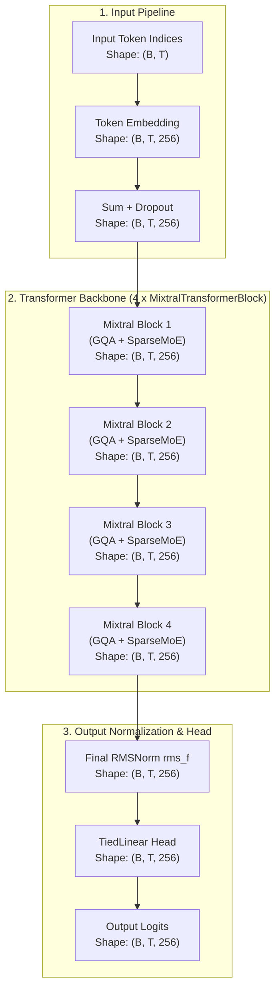
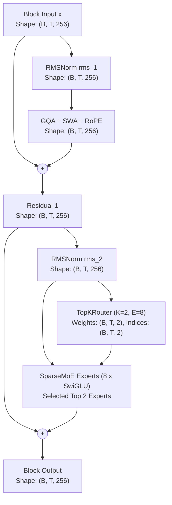

# Mixtral MoE Architecture

Comprehensive documentation of the **Mixtral MoE** architecture implemented in `NNFS`.

---

## 💡 Overview

[Mixtral of Experts](https://arxiv.org/abs/2401.04088) (Jiang et al., 2024) is a high-performance Sparse Mixture-of-Experts (SMoE) decoder-only language model. Built on top of the Mistral 7B foundation, Mixtral replaces the single feed-forward network in each transformer layer with 8 distinct expert feed-forward sub-blocks and a Top-2 router network.

Mixtral combines the parameter capacity of a large model with the execution speed of a much smaller model by activating only a fraction of its total parameters for each token during inference.

### Key Architectural Characteristics
- **Sparse Mixture-of-Experts (SMoE)**: Replaces standard FFN blocks with 8 distinct SwiGLU expert sub-blocks per layer.
- **Top-2 Softmax Routing**: For each input token at each layer, a linear gating network calculates logits over 8 experts, selecting the top 2 experts via Softmax-normalized routing weights.
- **Active vs. Total Parameter Efficiency**: Each token has access to the full model capacity while using only 2 active experts per layer during forward propagation.
- **Grouped-Query Attention (GQA)**: Query heads ($N_q$) are partitioned into groups sharing $N_{kv}$ key-value heads, compressing KV cache footprint.
- **Rotary Position Embeddings (RoPE)**: Rotary embeddings applied to queries and keys with base frequency $\theta = 1,000,000.0$.
- **Pre-RMSNorm & Tied Classification Head**: RMSNorm layer normalization applied prior to sub-layers, paired with a weight-tied linear output classification head.

---

## 🏗️ High-Level Architecture

The flow below details how input token sequences are transformed into output vocabulary logits in Mixtral MoE, with tensor dimensions using the baseline config (`vocab_size=256`, `d_model=256`, `block_size=1024`, `n_layers=4`, `num_experts=8`, `top_k_experts=2`).

---

## 🧩 Transformer Block (MixtralTransformerBlock)

Each `MixtralTransformerBlock` processes hidden states using Pre-RMSNorm residual connections around Grouped-Query Attention with RoPE/SWA and Sparse Mixture-of-Experts sub-layers.

### Mathematical Formulations

Given input tensor $x \in \mathbb{R}^{B \times T \times d_{\text{model}}}$:

1. **Sub-layer 1 (Grouped-Query Attention with RoPE)**:
   $$\mathbf{x}_{\text{norm1}} = \text{RMSNorm}(x, \gamma_1) = \frac{x}{\sqrt{\frac{1}{d_{\text{model}}} \sum_{i=1}^{d_{\text{model}}} x_i^2 + \epsilon}} \odot \gamma_1$$
   $$\mathbf{q} = \mathbf{x}_{\text{norm1}} W_q, \quad \mathbf{k} = \mathbf{x}_{\text{norm1}} W_k, \quad \mathbf{v} = \mathbf{x}_{\text{norm1}} W_v$$
   $$\mathbf{q}_{\text{rope}}, \mathbf{k}_{\text{rope}} = \text{ApplyRoPE}(\mathbf{q}, \mathbf{k}, \theta=10^6)$$
   $$\mathbf{x}_{\text{sub1}} = x + \text{Softmax}\left( \frac{\mathbf{q}_{\text{rope}} \mathbf{k}_{\text{rope}}^T}{\sqrt{d_{\text{head}}}} + \text{Mask} \right) \mathbf{v} W_o$$

2. **Sub-layer 2 (Sparse Mixture-of-Experts with Top-2 Routing)**:
   $$\mathbf{x}_{\text{norm2}} = \text{RMSNorm}(\mathbf{x}_{\text{sub1}}, \gamma_2)$$
   $$\mathbf{g} = \mathbf{x}_{\text{norm2}} W_g \quad \text{where } W_g \in \mathbb{R}^{d_{\text{model}} \times E}$$
   $$\text{Top2Indices}, \text{Top2Logits} = \text{Top2}(\mathbf{g})$$
   $$\text{RoutingWeights} = \text{Softmax}(\text{Top2Logits})$$
   $$\text{MoE}(\mathbf{x}_{\text{norm2}}) = \sum_{k \in \text{Top2Indices}} \text{RoutingWeights}_k \cdot \text{SwiGLU}_k(\mathbf{x}_{\text{norm2}})$$
   $$\mathbf{x}_{\text{output}} = \mathbf{x}_{\text{sub1}} + \text{MoE}(\mathbf{x}_{\text{norm2}})$$

---

## ⚙️ Component Breakdown

### 1. `TopKRouter`
The router computes linear gating logits $W_g \in \mathbb{R}^{d_{\text{model}} \times E}$ for each token state $x \in \mathbb{R}^{d_{\text{model}}}$, identifies top $K=2$ expert indices via `torch.topk`, and computes normalized routing probabilities using Softmax over the top $K$ logits.

### 2. `SparseMoE` Layer
Contains $E=8$ independent SwiGLU expert feed-forward sub-blocks. Tokens are routed dynamically to their designated top $K=2$ experts. Outputs from active experts are multiplied by their respective routing weights and accumulated into the output state.

### 3. `SwiGLU` Expert MLP
Each expert is a SwiGLU feed-forward network:
$$\text{SwiGLU}_i(x) = \left( \text{Swish}(x W_{\text{gate}}^{(i)}) \odot x W_{\text{up}}^{(i)} \right) W_{\text{down}}^{(i)}$$

### 4. Grouped-Query Attention (GQA) & RMSNorm
Standard GQA with $N_q=4$ query heads and $N_{kv}=2$ key-value heads, paired with bias-free linear projections and Pre-RMSNorm invariance scaling.

---

## 📊 Parameter & Shape Specifications

### Mini-Mixtral MoE Baseline Configurations (NNFS Default)

| Parameter | Symbol | Mini Value |
|---|---|---|
| Vocabulary Size | `vocab_size` | 256 |
| Context Length | `block_size` | 1024 |
| Hidden Dimension | `d_model` | 256 |
| Transformer Layers | `n_layers` | 4 |
| Attention Heads | `n_heads` | 4 |
| Head Dimension | `d_head` | 64 |
| Key-Value Heads | `n_kv_heads` | 2 |
| Feed-Forward Dim (Per Expert) | `d_ff` | 1024 |
| Number of Experts | `num_experts` | 8 |
| Active Experts per Token | `top_k_experts` | 2 |

### Parameter Breakdown (Total vs Active)

| Component | Parameters Formula | Total Count | Active Count per Token |
|---|---|---|---|
| Token Embedding (`tok_embed`) | $V \times d_{\text{model}}$ | 65,536 | 65,536 |
| **Per Transformer Block ($\times 4$)** | | | |
| ├── Attention RMSNorm (`rms_1`) | $d_{\text{model}}$ | 256 | 256 |
| ├── GQA Attention (`attn`) | $d_{\text{model}}^2 + 2 \cdot (d_{\text{model}} \cdot \frac{N_{kv}}{N_q} d_{\text{model}}) + d_{\text{model}}^2$ | 196,608 | 196,608 |
| ├── MoE Router (`router.gate`) | $d_{\text{model}} \times E$ | 2,048 | 2,048 |
| ├── MoE RMSNorm (`rms_2`) | $d_{\text{model}}$ | 256 | 256 |
| └── **8 SwiGLU Experts** ($E \times 3 \cdot d_{\text{model}} \cdot d_{\text{ff}}$) | $8 \times 786,432$ ($K=2$ active) | 6,291,456 | 1,572,864 |
| **Total Per Block ($\times 4$)** | | **6,490,624** | **1,772,032** |
| Final RMSNorm (`rms_f`) | $d_{\text{model}}$ | 256 | 256 |
| Final Head (`lm_head`) | Tied to `tok_embed` (0 new) | 0 | 0 |
| **Total Model Parameters** | | **26,028,288** | **7,153,920** |

---

## 🧪 Verification Workflow

After writing or updating model documentation:
1. Validate Mermaid syntax by inspecting the rendered diagram nodes.
2. Verify that parameter count formulas match exact module parameter counts printed by `build_model("configs/mixtral_moe_config.yaml")`.
3. Run the test suite: `.venv/bin/python -m unittest discover tests`.
