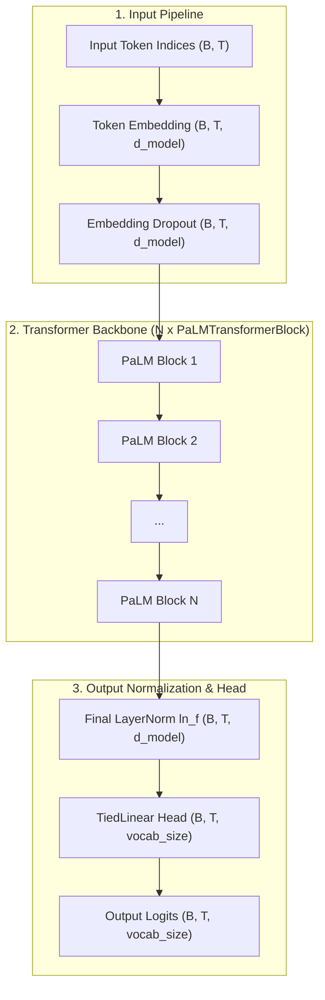
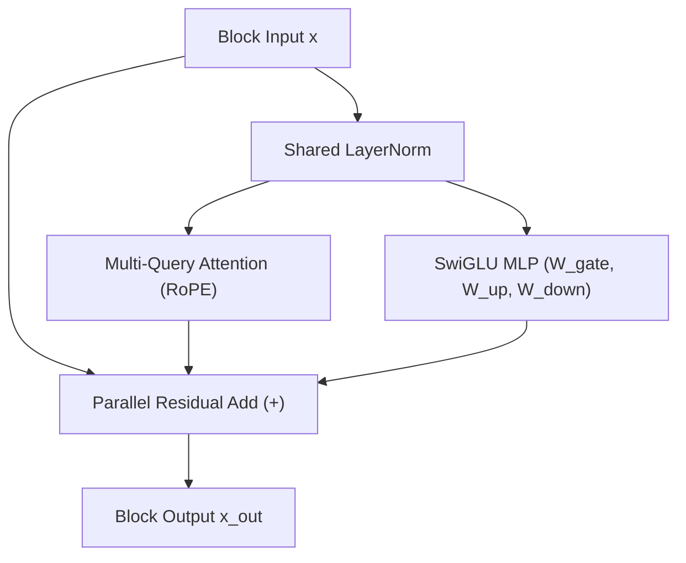

# PaLM Architecture

Comprehensive documentation of the **PaLM (Pathways Language Model)** architecture implemented in `NNFS`.

---

## 💡 Overview

PaLM is a landmark decoder-only Transformer language model introduced by Google in 2022 ([Chowdhery et al.](https://huggingface.co/papers/2204.02311)). PaLM introduced breakthrough architectural innovations designed for efficient scaling across massive compute clusters and fast autoregressive decoding:

In `NNFS`, PaLM implements:
- **Parallel Transformer Layers**: Attention and MLP sub-layers are computed concurrently off a single input `LayerNorm`.
- **Multi-Query Attention (MQA)**: Query heads remain multi-headed, but Key and Value projections share a single head across all Query heads to drastically reduce KV-cache footprint.
- **SwiGLU Activations**: Replaces GELU with SwiGLU ($\text{Swish}(x W_{\text{gate}}) \odot (x W_{\text{up}})$) in feed-forward networks.
- **Rotary Position Embeddings (RoPE)**: Replaces absolute position embeddings by rotating Query and Key vectors.
- **Bias-Free Dense Layers**: All linear transformations and layer norms use `bias=False` for increased training stability.
- **Weight Tying**: Shares token embedding weights with output classification head (`lm_head`).

---

## 🏗️ High-Level Architecture

The diagram below details how token inputs flow through PaLM's embedding, parallel transformer blocks, and output head.

---

## 🧩 Parallel Transformer Block

Each `PaLMTransformerBlock` computes attention and MLP in parallel off a shared `LayerNorm`, fusing operations and enabling identity residual connections.

### Mathematical Formulation

Given block input $x \in \mathbb{R}^{B \times T \times d_{\text{model}}}$:

1. **Shared Layer Normalization**:
   $$\text{x}_{\text{norm}} = \text{LayerNorm}(x)$$

2. **Parallel Sub-layers**:
   $$\text{y}_{\text{attn}} = \text{MultiQueryAttention}(\text{x}_{\text{norm}})$$
   $$\text{y}_{\text{mlp}} = \text{SwiGLUMLP}(\text{x}_{\text{norm}})$$

3. **Parallel Residual Addition**:
   $$\text{x}_{\text{out}} = x + \text{y}_{\text{attn}} + \text{y}_{\text{mlp}}$$

4. **Output Head**:
   $$\text{Logits} = \text{TiedLinear}\left(\text{LayerNorm}_f(\text{x}_{\text{final}})\right)$$

---

## 🔄 Structural Comparison: GPT-2 vs PaLM

| Architectural Aspect | GPT-2 | PaLM |
|---|---|---|
| **Transformer Block Execution** | **Sequential**: $x + \text{MLP}(\text{LN}(x + \text{Attn}(\text{LN}(x))))$ | **Parallel**: $x + \text{Attn}(\text{LN}(x)) + \text{MLP}(\text{LN}(x))$ |
| **Attention Mechanism** | Multi-Head Attention ($N_H$ K & V heads) | **Multi-Query Attention** ($1$ shared K & V head) |
| **Position Embeddings** | Learned Absolute Lookup ($T \times d_{\text{model}}$) | **Rotary Position Embeddings (RoPE)** on Q & K |
| **Activation Function** | GELU | **SwiGLU** ($\text{Swish}(x W_{\text{gate}}) \odot x W_{\text{up}}$) |
| **Dense Kernel Biases** | Standard linear bias ($W x + b$) | **No Biases** (`bias=False` across all layers) |

---

## 📊 Parameter & Shape Specifications

### Mini-PaLM Baseline Configurations (NNFS Default)

| Parameter | Symbol | Mini Value |
|---|---|---|
| Vocabulary Size | `vocab_size` | 256 |
| Context Length | `block_size` | 1024 |
| Hidden Dimension | `d_model` | 256 |
| Transformer Layers | `n_layers` | 4 |
| Attention Heads | `n_heads` | 4 |
| Head Dimension | `d_head` | 64 |
| Feed-Forward Dim | `d_ff` | 1024 |

### Parameter Breakdown

| Component | Parameters Formula | Count (Mini Config) |
|---|---|---|
| Token Embedding (`tok_embed`) | $V \times d_{\text{model}}$ | 65,536 |
| Positional Embedding (`pos_embed`) | None (RoPE based) | 0 |
| **Per Transformer Block ($\times 4$)** | | |
| - Shared LayerNorm (`ln`) | $2 \times d_{\text{model}}$ | 512 |
| - MQA Projections (`q`, `k`, `v`, `out`) | $d_{\text{model}}^2 + 2(d_{\text{model}} \cdot d_{\text{head}}) + d_{\text{model}}^2$ | 163,840 |
| - SwiGLU MLP (`w_gate`, `w_up`, `w_down`) | $3 \times (d_{\text{model}} \cdot d_{\text{ff}})$ | 786,432 |
| **Total Block Params ($\times 4$)** | $4 \times 950,784$ | 3,803,136 |
| **Final LayerNorm (`ln_f`)** | $2 \times d_{\text{model}}$ | 512 |
| Final Head (`lm_head`) | Tied to `tok_embed` (0 new) | 0 |
| **Total Model Parameters** | | **3,869,184** |

