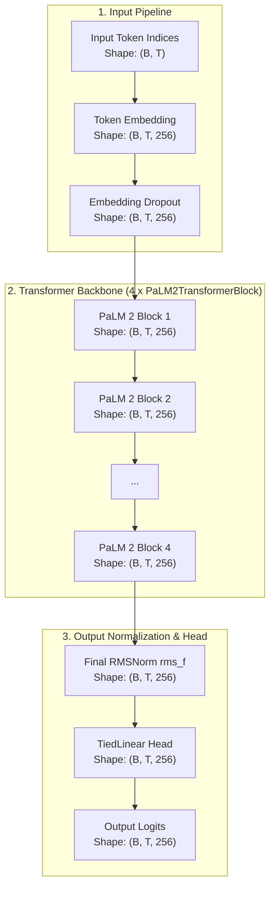
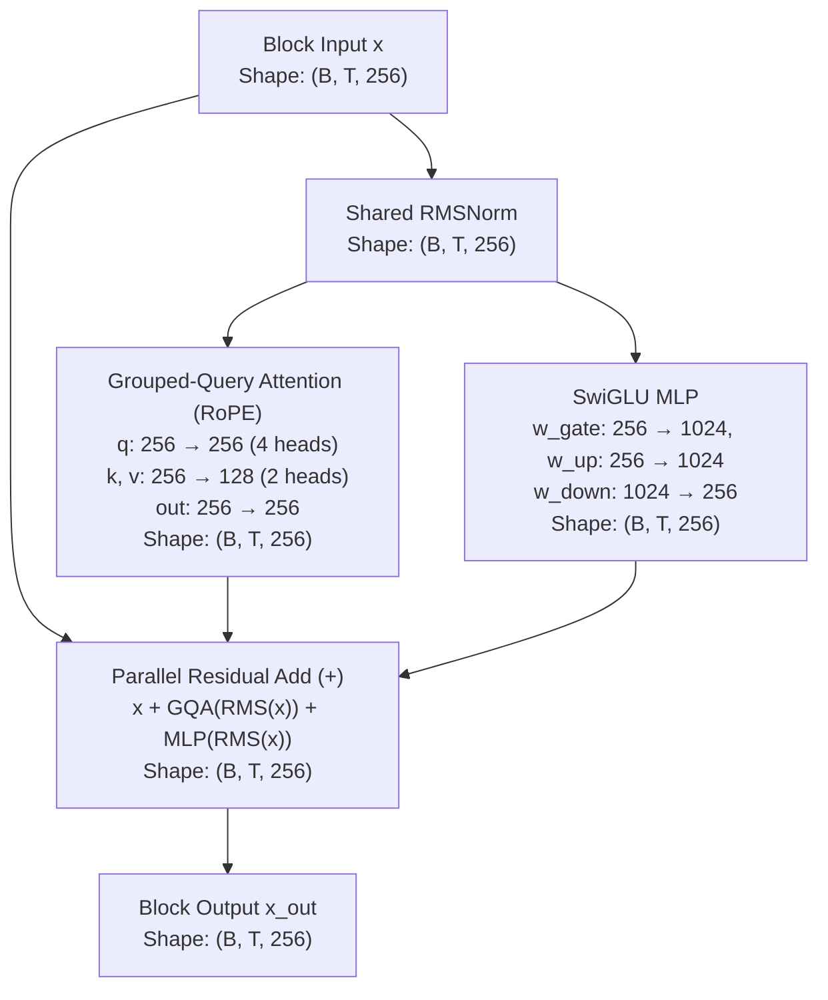

# PaLM 2 Architecture

Comprehensive documentation of the **PaLM 2 (Pathways Language Model 2)** architecture implemented in `NNFS`.

---

## 💡 Overview

PaLM 2 is Google's next-generation decoder-only Transformer language model introduced in May 2023 ([Anil et al.](https://huggingface.co/papers/2305.10403)). Building upon the original PaLM ([Chowdhery et al.](https://huggingface.co/papers/2204.02311)), PaLM 2 incorporates major architectural refinements, compute-optimal 1:1 scaling (scaling dataset size and model parameters roughly 1:1), and a diverse UL2 pre-training mixture.

In `NNFS`, PaLM 2 is implemented with modular primitives matching the **Parallel Transformer Block** design with pre-`RMSNorm` normalization.

### Key Architectural Characteristics
- **Parallel Transformer Layers with Pre-RMSNorm**: Attention and Feed-Forward sub-layers are computed concurrently off a single shared `RMSNorm` pre-normalization layer.
- **Grouped-Query Attention (GQA) & Multi-Query Attention (MQA)**: Query heads retain multi-headed capacity ($h=4$), while Key and Value projections share a reduced number of heads ($n_{\text{kv\_heads}}=2$ in mini config, or $1$ for MQA) to drastically minimize KV-cache memory during autoregressive decoding.
- **SwiGLU Activation Function**: Replaces standard GELU activations with SwiGLU ($\text{Swish}(x W_{\text{gate}}) \odot (x W_{\text{up}})$) in feed-forward networks.
- **Rotary Position Embeddings (RoPE)**: Replaces absolute position embeddings by rotating Query and Key vectors.
- **Bias-Free Linear Layers**: All linear transformations use `bias=False` across attention, MLP, and output head for increased training stability.
- **Tied Embedding Weights**: Output classification head (`TiedLinear`) shares weights with the token embedding matrix (`Embedding`).

---

## 🏗️ High-Level Architecture

The flow below details how input token sequences are transformed into output vocabulary logits in PaLM 2, with tensor dimensions using the baseline config (`vocab_size=256`, `d_model=256`, `block_size=1024`, `n_layers=4`, `n_heads=4`, `n_kv_heads=2`).

---

## 🧩 Parallel Transformer Block (PaLM2TransformerBlock)

Each `PaLM2TransformerBlock` computes attention and MLP in parallel off a shared `RMSNorm`, fusing operations and enabling identity residual connections.

### Mathematical Formulations

Given block input $x \in \mathbb{R}^{B \times T \times d_{\text{model}}}$:

1. **Shared RMS Normalization**:
   $$\text{x}_{\text{norm}} = \text{RMSNorm}(x) = \frac{x}{\sqrt{\frac{1}{d_{\text{model}}} \sum_{i=1}^{d_{\text{model}}} x_i^2 + \epsilon}} \odot \gamma$$

2. **Parallel Sub-layers**:
   $$\text{y}_{\text{attn}} = \text{GroupedQueryAttention}(\text{x}_{\text{norm}})$$
   $$\text{y}_{\text{mlp}} = \text{SwiGLUMLP}(\text{x}_{\text{norm}})$$

3. **Parallel Residual Addition**:
   $$\text{x}_{\text{out}} = x + \text{y}_{\text{attn}} + \text{y}_{\text{mlp}}$$

4. **Output Head**:
   $$\text{Logits} = \text{TiedLinear}\left(\text{RMSNorm}_f(\text{x}_{\text{final}})\right)$$

---

## ⚙️ Component Breakdown

### 1. `GroupedQueryAttention` / `MultiQueryAttention` with RoPE
Computes attention where Query projections retain multiple heads ($h=4$) while Key ($K$) and Value ($V$) share $n_{\text{kv\_heads}} = 2$ heads:
$$Q \in \mathbb{R}^{B \times T \times h \times d_{\text{head}}}, \quad K, V \in \mathbb{R}^{B \times T \times n_{\text{kv\_heads}} \times d_{\text{head}}}$$
$$\text{Attention}(Q, K, V) = \text{Softmax}\left(\frac{\text{RoPE}(Q) \cdot \text{RoPE}(K)^T}{\sqrt{d_{\text{head}}}} + M\right) V$$

### 2. `SwiGLUMLP`
Parallel feed-forward sub-layer using Swish-gated activations:
$$\text{SwiGLU}(x) = \left(\text{Swish}(x W_{\text{gate}}) \odot (x W_{\text{up}})\right) W_{\text{down}}$$

### 3. `RMSNorm`
Root Mean Square normalization scaling hidden dimensions without mean centering or bias vectors.

### 4. `TiedLinear`
Reuses token embedding weights $W_{\text{tok}} \in \mathbb{R}^{V \times d_{\text{model}}}$ as transposed weights $W_{\text{head}} = W_{\text{tok}}^T \in \mathbb{R}^{d_{\text{model}} \times V}$ for output logits.

---

## 🔄 Structural Comparison: PaLM vs PaLM 2

| Architectural Aspect | PaLM (1) | PaLM 2 |
|---|---|---|
| **Pre-Normalization** | Standard `LayerNorm` ($\gamma$ scale, $\beta$ shift) | **`RMSNorm`** (scale-only, zero bias) |
| **Attention Mechanism** | Multi-Query Attention ($1$ shared KV head) | **Grouped / Multi-Query Attention** ($n_{\text{kv\_heads}} = 2$ or $1$) |
| **Transformer Block Execution** | **Parallel**: $x + \text{Attn}(\text{LN}(x)) + \text{MLP}(\text{LN}(x))$ | **Parallel**: $x + \text{Attn}(\text{RMSNorm}(x)) + \text{MLP}(\text{RMSNorm}(x))$ |
| **Pre-Training Objective** | Monolithic Causal LM | **UL2 Mixture** (Causal LM + Prefix LM + Span Denoising) |
| **Scaling Philosophy** | Parameter-heavy ($3\times$ param growth) | Compute-optimal 1:1 scaling (Smaller params, more tokens) |
| **Dense Kernel Biases** | `bias=False` across all layers | `bias=False` across all layers |

---

## 📊 Parameter & Shape Specifications

### Mini-PaLM 2 Baseline Configurations (NNFS Default)

| Parameter | Symbol | Mini Value |
|---|---|---|
| Vocabulary Size | `vocab_size` | 256 |
| Context Length | `block_size` | 1024 |
| Hidden Dimension | `d_model` | 256 |
| Transformer Layers | `n_layers` | 4 |
| Attention Heads | `n_heads` | 4 |
| Key/Value Heads | `n_kv_heads` | 2 |
| Head Dimension | `d_head` | 64 |
| Feed-Forward Dim | `d_ff` | 1024 |

### Parameter Breakdown

| Component | Parameters Formula | Count (Mini Config) |
|---|---|---|
| Token Embedding (`tok_embed`) | $V \times d_{\text{model}}$ | 65,536 |
| Positional Embedding (`pos_embed`) | None (RoPE based) | 0 |
| **Per Transformer Block ($\times 4$)** | | |
| - Shared RMSNorm (`rms`) | $d_{\text{model}}$ | 256 |
| - GQA Projections (`q`, `k`, `v`, `out`) | $d_{\text{model}}^2 + 2(d_{\text{model}} \cdot n_{\text{kv\_heads}} \cdot d_{\text{head}}) + d_{\text{model}}^2$ | 196,608 |
| - SwiGLU MLP (`w_gate`, `w_up`, `w_down`) | $3 \times (d_{\text{model}} \cdot d_{\text{ff}})$ | 786,432 |
| **Total Block Params ($\times 4$)** | $4 \times 983,296$ | 3,933,184 |
| **Final RMSNorm (`rms_f`)** | $d_{\text{model}}$ | 256 |
| Final Head (`lm_head`) | Tied to `tok_embed` (0 new) | 0 |
| **Total Model Parameters** | | **3,998,976** |
