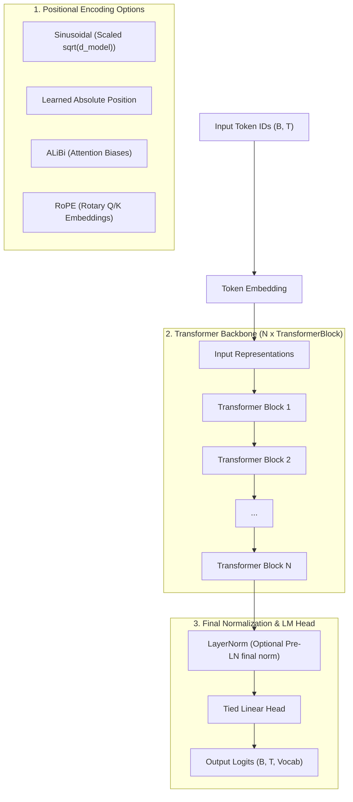

# Transformer Architecture

Comprehensive documentation of the **Transformer** architecture implemented in `NNFS`.

---

## 📌 Architectural Overview

The **Transformer** in `NNFS` is a modular, autoregressive decoder model based on foundational principles from *\"Attention Is All You Need\"* ([Vaswani et al., 2017](https://arxiv.org/abs/1706.03762)) and extended with support for configurable positional encodings and activation functions.

In `NNFS`, `Transformer` is built ground-up with custom primitives, enabling:
- **Configurable Positional Encodings**: `sinusoidal` (Vaswani et al.), `learned` (GPT-1/2), `alibi` (Press et al.), `rope` (Rotary Position Embeddings), or `none`.
- **Configurable Activation Functions**: `relu`, `gelu`, or `swiglu`.
- **Post-LN / Pre-LN Options**: Post-Layer Normalization by default, with flexible Pre-LN support via `norm_first=True`.
- **Tied Output Embeddings**: Weight tying between input token embeddings and output projection layer (`lm_head`).



---

## 🧩 Transformer Block (`TransformerBlock`)

Each `TransformerBlock` processes sequence states using two main sub-layers: **Causal Multi-Head Self-Attention** and a **Position-Wise Feed-Forward Network**.

### Architecture Sub-Layers:

1. **Causal Multi-Head Self-Attention**:
   - Computes standard multi-head self-attention with causal lower-triangular masking.
   - Supports optional **ALiBi** biases or **RoPE** rotary position embeddings on query and key vectors.

2. **Position-Wise Feed-Forward Network**:
   - Supports **ReLU** or **GELU** using `MLP` (`d_model` $\rightarrow$ `d_ff` $\rightarrow$ `d_model`).
   - Supports **SwiGLU** using `SwiGLUMLP` (`w_gate`, `w_up`, `w_down`).

---

## ⚙️ Hyperparameters

| Hyperparameter | Symbol | Default | Description |
| :--- | :--- | :--- | :--- |
| **Vocab Size** | $V$ | $32000$ | Vocabulary size |
| **Block Size** | $T_{\text{max}}$ | $512$ | Maximum sequence context length |
| **Hidden Dimension** | $d_{\text{model}}$ | $512$ | Token hidden representation dimension |
| **Number of Layers** | $N$ | $6$ | Stacked `TransformerBlock` layers |
| **Attention Heads** | $h$ | $8$ | Number of parallel attention heads |
| **FFN Hidden Dim** | $d_{\text{ff}}$ | $2048$ | Feed-forward intermediate expansion dimension |
| **Positional Encoding** | - | `"sinusoidal"` | `sinusoidal`, `learned`, `alibi`, `rope`, `none` |
| **Activation Function** | - | `"relu"` | `relu`, `gelu`, `swiglu` |
| **Pre-LN Mode** | `norm_first` | `False` | Apply LayerNorm before sub-layers if `True` |

---

## 🚀 Usage Example

```python
import torch
from nnfs.models import Transformer, TransformerConfig

# Instantiate a Transformer model with RoPE and SwiGLU activations
config = TransformerConfig(
    vocab_size=32000,
    block_size=512,
    d_model=512,
    n_layers=6,
    n_heads=8,
    d_ff=2048,
    positional_encoding="rope",
    activation="swiglu",
    norm_first=True,
)

model = Transformer(config)

idx = torch.randint(0, 32000, (2, 64))
logits = model(idx)
print(logits.shape) # (2, 64, 32000)
```
