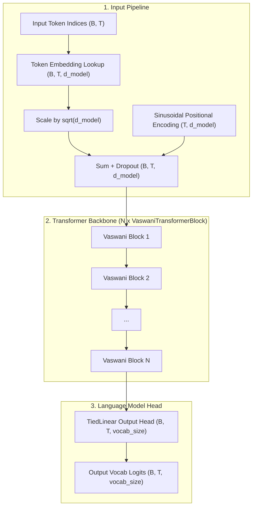
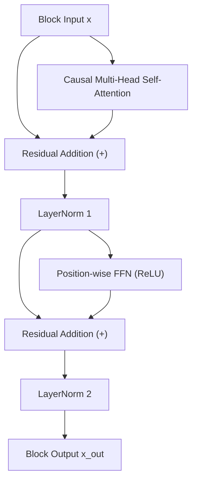

# Vaswani Decoder-Only Architecture

Comprehensive documentation of the **Vaswani Decoder-Only Transformer** architecture implemented in `NNFS`.

---

## 💡 Overview

The **Vaswani Decoder-Only Transformer** adapts the original Transformer components from *"Attention Is All You Need"* ([Vaswani et al., 2017](https://arxiv.org/abs/1706.03762)) into a pure autoregressive decoder language model. While the 2017 paper introduced an Encoder-Decoder model for sequence translation, this implementation translates its foundational primitives—**Sinusoidal Positional Encodings**, **$\sqrt{d_{\text{model}}}$ Embedding Scaling**, **Position-Wise FFN with ReLU Activation**, **Multi-Head Self-Attention**, **Post-Layer Normalization**, and **Tied Output Embeddings**—into a causal sequence predictor.

In `NNFS`, `VaswaniDecoderOnly` is built ground-up with modular primitives, enabling both original Post-LN and modern Pre-LN configurations.

### Key Architectural Characteristics
- **Sinusoidal Positional Encodings**: Static sine and cosine position encodings computed across sequence length $T$ (non-trainable).
- **Embedding Scaling**: Token embeddings lookup values are scaled by $\sqrt{d_{\text{model}}}$ prior to addition with positional encodings.
- **Position-Wise FFN (ReLU)**: Two-layer expansion network with standard $\text{ReLU}(x) = \max(0, x)$ non-linearity.
- **Post-LN / Pre-LN Options**: Post-Layer Normalization by default (matching Vaswani et al.), with flexible Pre-LN support via `norm_first=True`.
- **Tied Embedding Weights**: Classification output head (`TiedLinear`) reuses weights from the token embedding matrix (`Embedding`).
- **Causal Attention Masking**: Scaled dot-product self-attention with lower-triangular causal mask.

---

## 🏗️ High-Level Architecture



---

## 🧩 Transformer Block (Vaswani et al. Post-LN Baseline)

Each `VaswaniTransformerBlock` processes sequence states using two main sub-layers: **Causal Multi-Head Self-Attention** and a **Position-Wise ReLU Expansion Network**.



### Mathematical Formulations

Given input hidden state $x \in \mathbb{R}^{B \times T \times d_{\text{model}}}$:

1. **Causal Self-Attention Sub-layer**:
   $$\text{x}_{\text{attn}} = \text{CausalMultiHeadAttention}(x)$$
   $$\text{x}_{\text{sub1}} = \text{LayerNorm}_1(x + \text{Dropout}(\text{x}_{\text{attn}}))$$

2. **Position-wise Feed-Forward Sub-layer**:
   $$\text{x}_{\text{ffn}} = \max(0, \text{x}_{\text{sub1}} W_1 + b_1) W_2 + b_2$$
   $$\text{x}_{\text{out}} = \text{LayerNorm}_2(\text{x}_{\text{sub1}} + \text{Dropout}(\text{x}_{\text{ffn}}))$$

---

## ⚙️ Hyperparameters (Vaswani Base Adaptation)

| Hyperparameter | Symbol | Base Value | Description |
|---|---|---|---|
| Model Dimension | $d_{\text{model}}$ | $512$ | Hidden dimension of token states |
| Number of Layers | $N$ | $6$ | Stacked `VaswaniTransformerBlock` layers |
| Attention Heads | $h$ | $8$ | Parallel self-attention heads |
| Head Dimension | $d_k, d_v$ | $64$ | Projection dimension per head ($d_{\text{model}} / h$) |
| FFN Inner Dimension | $d_{\text{ff}}$ | $2048$ | Hidden layer dimension in FFN ($4 \times d_{\text{model}}$) |
| Dropout Rate | $P_{\text{drop}}$ | $0.1$ | Dropout probability applied across sub-layers |
| Norm Placement | `norm_first` | `False` | Post-LN (`False`) vs Pre-LN (`True`) |

---

## 💻 Code Usage Example

```python
import torch
from nnfs.models import VaswaniDecoderOnly, VaswaniDecoderOnlyConfig
from nnfs.utils import generate

# Instantiate model configuration
config = VaswaniDecoderOnlyConfig(
    vocab_size=32000,
    block_size=512,
    d_model=512,
    n_layers=6,
    n_heads=8,
    d_ff=2048,
    dropout=0.1,
    norm_first=False,
)

model = VaswaniDecoderOnly(config)

# Forward pass
input_ids = torch.randint(0, config.vocab_size, (2, 128))
logits = model(input_ids)  # Shape: (2, 128, 32000)

# Autoregressive generation
prompt = torch.tensor([[1, 2, 3]])
generated = generate(model, prompt, max_new_tokens=20)
```
